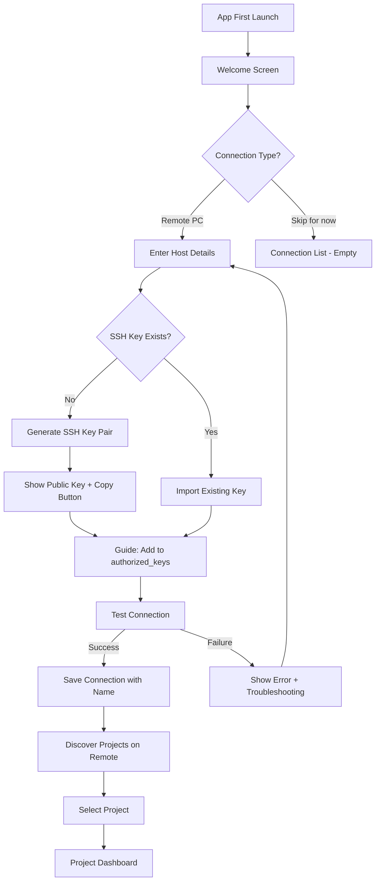

# UX Design Specification: TinSu Mobile

**Author:** Tinsu
**Date:** 2026-04-06

---

## Executive Summary

### Project Vision

TinSu Mobile is a native mobile app (Android + iOS) that extends the TinSu AI Agent Orchestration Platform to phones, eliminating the desk dependency that locks technical founders out of their AI-powered workflows when traveling. The phone becomes a mobile-optimized control plane for existing desktop projects via SSH/mosh connectivity.

The app is not a monitoring dashboard — it enables active project work: chatting with AI agents, reviewing code diffs, reading planning documents, and approving or rejecting implementation tasks. The same workflow that runs on desktop runs on mobile, wrapped in a purpose-built touch UI.

The design direction is "Industrial-Utilitarian Terminal Luxe" — a refined control room aesthetic with dark-by-default theming, monospaced code fonts (JetBrains Mono), instrument-panel status indicators, and dense information display that never feels cluttered. Think Bloomberg Terminal meets a well-designed dark-mode IDE, optimized for a 6-inch screen.

### Target Users

**Primary: The Technical Startup Founder on the Go**

- Uses Claude Code and the BMAD Method daily on their desktop
- Frequently away from their desk (commute, travel, coffee shops, social outings)
- Loses productive hours when unable to access their projects
- Power user who thinks in terminals but wants structured, touch-optimized mobile interaction
- Wants to ship real work from their phone — not just check status

**User Context:**
- Tech-savvy: comfortable with SSH, tmux, CLI tools, and code review
- Primary device: 6-inch phone screen (Android first, iOS follows)
- Usage contexts: trains, coffee shops, bars, walking, any moment away from desk
- Network conditions: varies from solid WiFi to spotty cellular to zero signal
- Session duration: 5-45 minutes of focused mobile work

**Dog-food first:** The founder (Tinsu) is the primary user for MVP validation. Success means reaching for TinSu Mobile every time there's dead time.

### Key Design Challenges

1. **Information Density on a 6-inch Screen** — Code diffs, agent chat with structured output, and planning documents are inherently content-heavy. The UX must deliver terminal-grade information density in a thumb-friendly format without cramming or requiring constant zooming. Every pixel must earn its place.

2. **Connection-Dependent Experience** — All data flows through SSH/mosh to a remote PC. The UX must gracefully handle the full connectivity spectrum: solid WiFi, flaky cellular, network transitions (WiFi ↔ cellular), brief dropouts, and full offline mode. Connection status must be always-visible, informative, and calm — never anxiety-inducing.

3. **Touch Translation of Keyboard-First Workflows** — The desktop app's "60-Second Velocity Loop" (Review → Approve → Commit → Next) is keyboard-driven. Mobile must translate this into equally fast touch interactions: swipe, tap, quick-action buttons. The review cycle must not feel slower on mobile.

4. **Code Readability Without Zooming** — Unified diffs with syntax highlighting must be legible at default zoom on a phone. This requires careful font sizing (13sp baseline), horizontal scroll for long lines, and a natural pinch-to-zoom (1x–3x) for detailed inspection.

5. **Offline Graceful Degradation** — Users will lose signal mid-session. Cached documents, chat history, and diffs must remain readable. Unsent messages must queue and deliver on reconnect. The transition between online and offline must feel seamless, not catastrophic.

### Design Opportunities

1. **The "Dead Time → Work Time" Moment** — The aha moment is connecting to your PC from the train in 3 seconds and reviewing code the agent wrote overnight. Design this first experience to feel instant and magical — saved one-tap connections, immediate project context, zero friction.

2. **Status-at-a-Glance Dashboard** — A well-designed project overview showing "3 reviews pending, 2 agents active, 1 completed overnight" in a single scan. This becomes the habit-forming screen founders open every time they reach for their phone — the mobile equivalent of checking the Kanban board.

3. **Quick-Action Review Loop** — Approve with a single tap, request changes with a quick text note, reject with confirmation. The review workflow on mobile should feel faster than opening a laptop for simple approvals. This is the core value proposition — completing the review cycle from your phone.

4. **Connection Resilience as a Feature** — Mosh's inherent resilience (surviving network transitions, buffering through drops) is invisible to users of raw terminal apps. TinSu Mobile can make this visible: a smooth yellow "Reconnecting..." → green "Connected" transition that builds confidence in the tool's reliability.

## Core User Experience

### Defining Experience

The core TinSu Mobile experience is **The Mobile Agent Loop**:

1. **Connect** — One-tap to your saved PC connection. Mosh connects in 3 seconds.
2. **Chat** — Open an agent session. Read what happened since you left. Send follow-up messages, refine requirements, ask questions, drive the conversation.
3. **Review** — Read planning docs the agent produced or updated. Browse diffs when implementation tasks reach Review status.
4. **Act** — Approve, request changes, or provide feedback inline. The agent picks it up immediately on your PC.

This is a **conversation-and-review** tool, not a project management tool on mobile. The Kanban board, sprint planning, and task creation stay on desktop. Mobile is where you **talk to your agents and read what they wrote**.

### Platform Strategy

| Aspect | Decision | Rationale |
|---|---|---|
| **Primary Platform** | Android (Jetpack Compose + Material 3 Expressive) | Founder's device; ship first |
| **Secondary Platform** | iOS (SwiftUI + HIG) | KMP shared logic makes iOS mostly a UI build |
| **Input Mode** | Touch-first, thumb-optimized | All interactions designed for one-handed phone use |
| **Primary Orientation** | Portrait | How people hold phones on trains and while walking |
| **Dark Mode** | Default | Terminal-adjacent tool — dark is the natural environment |
| **Offline** | Read-only cached content | Docs, chat history, and diffs readable without connection |
| **Network Resilience** | Mosh + automatic reconnect | Connection survives WiFi ↔ cellular transitions seamlessly |

### Effortless Interactions

| Interaction | What Happens Automatically |
|---|---|
| **Connection** | One-tap saved connection. Mosh handles network transitions invisibly. No re-authentication. |
| **Session Resumption** | tmux sessions persist on the remote PC. App reconnects and shows exactly where you left off — same chat position, same scroll state. |
| **Chat Context** | Full conversation history loads from the tmux session. No "what were we talking about?" — the agent's context is the tmux scrollback. |
| **Document Caching** | Viewed planning docs cached locally. Open the app on the subway with no signal — your last-read docs are there. |
| **Sync on Reconnect** | When signal returns, cache invalidation happens silently. Stale docs refresh. Queued messages send. No manual refresh needed. |
| **Connection Status** | Always-visible indicator: green/yellow/red/gray. Informative but calm — no modal dialogs or blocking alerts for transient disconnects. |

### Critical Success Moments

| Moment | Experience | Why It Matters |
|---|---|---|
| **The First Connection** | Tap saved connection → connected in 3 seconds → project dashboard loads | "This actually works from my phone" — trust established |
| **The Train Chat** | Open agent chat on commute → read overnight progress → send refinement → agent responds | "I'm making real progress from the train" — value proven |
| **The Doc Read** | Browse planning docs with rendered markdown → pinch-zoom on a diagram → find what you need | "I don't need my laptop to read this" — convenience realized |
| **The Quick Approval** | See review-ready task → open diff → scan 4 changed files → tap Approve | "That took 30 seconds from my phone" — velocity unlocked |
| **The Network Survive** | Signal drops in a tunnel → yellow bar → signal returns → green bar → no data lost | "It just handled that" — reliability confidence |
| **The Offline Read** | No signal underground → open cached PRD → read through requirements → mentally prepare for next chat | "Dead time is still useful" — offline value |

### Experience Principles

1. **Chat First, Everything Else Second** — Agent conversation is the primary interaction. Navigation, layout, and screen real estate all prioritize the chat experience. When in doubt, optimize for chatting.

2. **One-Tap to Productive** — From app open to meaningful interaction in under 5 seconds. Saved connections, session resumption, and cached state eliminate friction. Zero setup on repeat visits.

3. **Read More Than Write** — Mobile sessions are read-heavy: reading agent responses, reviewing docs, scanning diffs. Optimize for comfortable reading. Writing is shorter: quick messages, brief feedback notes, tap-to-approve.

4. **Connection is Invisible** — The user thinks about their project, not their network. Mosh, reconnection, caching, and sync all happen below the surface. The only visible signal is a calm status indicator.

5. **Thumb-Friendly Density** — Dense information (because power users want it), but every touch target is 48dp+ and reachable with one thumb. No tiny buttons, no precision tapping required.

## Desired Emotional Response

### Primary Emotional Goals

**In Control, Even From a Phone** — The dominant emotion is calm authority. The user feels like they're sitting at their desk, not wrestling with a tiny screen. Every interaction confirms: "I have full visibility and can act decisively."

**Productive, Not Guilty** — Dead time (commutes, waiting rooms) transforms into legitimate work time. The user feels productive accomplishment, not the guilt of "I should be working but can't."

**Trust in the Connection** — The user trusts that their message will arrive, that the session won't vanish, that cached data is real. Network resilience builds a background feeling of reliability.

### Emotional Journey Mapping

| Stage | Desired Emotion | Design Implication |
|---|---|---|
| **App Open** | Anticipation — "Let's see what happened" | Dashboard shows overnight summary immediately |
| **Connecting** | Confidence — "This will work" | Fast connection with smooth animation, no loading spinner anxiety |
| **Chatting** | Flow — "I'm in the conversation" | Minimal chrome, maximum chat space, keyboard-aware layout |
| **Reading Docs** | Focus — "This is readable and comfortable" | Clean markdown rendering, generous line height, easy scroll |
| **Reviewing Diffs** | Precision — "I can see exactly what changed" | Clear color coding, legible font, pinch-to-zoom for detail |
| **Approving** | Satisfaction — "Done. Shipped from my phone." | Haptic feedback on approve, brief success confirmation |
| **Network Drop** | Calm — "It's handling this" | Yellow indicator, no modal interruption, silent reconnect |
| **Offline** | Reassurance — "I can still read and prepare" | Cached content loads instantly, clear "offline" badge |

### Micro-Emotions

| Emotion Pair | Design Response |
|---|---|
| **Confidence vs. Confusion** | Clear navigation, consistent patterns, status always visible. Never leave the user wondering "where am I?" or "is this working?" |
| **Trust vs. Skepticism** | Show connection health honestly. Green means connected. Yellow means reconnecting. Never fake a connected state. |
| **Accomplishment vs. Frustration** | Every session should end with something done — a message sent, a doc read, a task approved. Design for micro-completions. |
| **Focus vs. Distraction** | Full-screen chat and document views. Minimal notification interruptions. The app respects the user's limited mobile attention. |

### Emotional Design Principles

1. **Honest Indicators** — Connection status, sync state, and agent status are always truthful. A green dot means connected. A spinning indicator means actually loading. Never use optimistic UI that lies about state.

2. **Silent Competence** — Reconnection, cache sync, and message queuing happen without fanfare. The app is competent in the background. Errors surface only when user action is needed.

3. **Micro-Celebrations** — Brief haptic pulse on successful approve. Subtle animation when a message sends. These tiny moments reinforce "I did something real."

4. **Calm Degradation** — When things go wrong (network drops, session ends), the UI stays calm. Yellow banners, not red alerts. Informative messages, not panic dialogs.

## UX Pattern Analysis & Inspiration

### Inspiring Products Analysis

**1. Termius (Mobile SSH Client)**

- **What it does well:** Clean connection management, saved hosts with one-tap access, SSH key management built in, dark terminal aesthetic.
- **What it lacks:** Raw terminal output — no structured UI for chat or code review. Users must read raw tmux output. No concept of "projects" or "agents."
- **What to learn:** Connection list UX, key management flow, the expectation mobile SSH users have for how saved connections should look and behave.

**2. GitHub Mobile**

- **What it does well:** Diff viewer that works on phone screens (unified diff, syntax highlighting, file browser). Pull request review with approve/request changes. Clean notification-to-action flow.
- **What it lacks:** Read-heavy — you can approve PRs but can't drive AI agents or have interactive conversations. No session persistence concept.
- **What to learn:** Mobile diff viewer patterns, review action UX (approve/request changes buttons), how to show file change summaries compactly.

**3. Slack Mobile**

- **What it does well:** Chat UI that feels native and fast. Keyboard-aware input. Message threading. Quick reactions. Smooth network transition handling.
- **What it lacks:** Not designed for code or structured technical output. No concept of agent sessions or terminal interaction.
- **What to learn:** Chat input UX, message bubble layout, how chat apps handle keyboard appearance/dismissal, the feel of a responsive conversation UI.

**4. iA Writer (Mobile Markdown Editor)**

- **What it does well:** Beautiful markdown rendering on small screens. Focus mode. Readable typography. Clean document browsing.
- **What it lacks:** No collaborative or agent interaction. Static documents only.
- **What to learn:** Markdown rendering aesthetics, document typography, how to make long-form text comfortable to read on a phone.

### Transferable UX Patterns

**Navigation Patterns:**

- **Termius's connection list** → TinSu's saved connections screen: cards with host name, last connected time, status indicator
- **GitHub Mobile's tab bar** → TinSu's bottom navigation: Chat | Docs | Tasks | Settings
- **Slack's thread navigation** → TinSu's agent session list: sessions as conversations with status and last message preview

**Interaction Patterns:**

- **GitHub Mobile's diff viewer** → TinSu's code review: unified diff, file-level navigation, line-number gutter, add/remove color coding
- **GitHub Mobile's review actions** → TinSu's approve/request changes: sticky bottom bar with action buttons
- **Slack's chat input** → TinSu's message input: expanding text field, send button, keyboard-aware positioning

**Visual Patterns:**

- **Termius's dark terminal aesthetic** → TinSu's "Terminal Luxe" dark theme: #0D1117 background, monospaced fonts, muted surfaces
- **iA Writer's typography** → TinSu's document viewer: generous line height, readable font sizing, clean headings
- **GitHub Mobile's status badges** → TinSu's agent status chips: colored pills showing Thinking/Idle/Completed/Exited

### Anti-Patterns to Avoid

| Anti-Pattern | Why It Fails | TinSu Alternative |
|---|---|---|
| **Raw terminal output on phone** (Termius approach) | Unreadable at phone size, no touch affordances, monospaced wall of text | Structured UI: chat bubbles, rendered markdown, visual diffs |
| **Side-by-side diff on phone** | Not enough horizontal space — both sides become unreadable | Unified diff only on phones. Side-by-side only on tablets. |
| **Modal connection dialogs** | Interrupts flow, feels heavy for a quick-connect action | Inline connection cards, bottom sheet for details |
| **Blocking loading screens** | Kills the "instant" feeling on reconnect | Skeleton loading, show cached data immediately, sync in background |
| **Red error banners for network issues** | Creates anxiety for a normal mobile condition | Yellow "Reconnecting..." banner, calm language, auto-resolution |
| **Hamburger menu for primary navigation** | Hides features, adds taps, doesn't work for 4-tab architecture | Bottom NavigationBar with visible tabs and badge counts |

### Design Inspiration Strategy

**Adopt:**
- GitHub Mobile's diff viewer layout and review action bar
- Slack's chat input keyboard handling and message list performance
- Termius's connection list card pattern with one-tap access

**Adapt:**
- GitHub Mobile's file browser → simplified for planning docs (flat list, not tree)
- Slack's message bubbles → agent bubbles use monospaced font for code-heavy output
- iA Writer's markdown rendering → dark theme variant with code block emphasis

**Avoid:**
- Any raw terminal display as a primary interface
- Side-by-side layouts on phone screens
- Cloud-centric patterns (login, account creation, sync indicators) — this is SSH-only

## Design System Foundation

### Design System Choice

**Android:** Material 3 Expressive (Compose BOM 2025.05.01+) — the latest Material Design with spring physics animations, 35+ shape options, and refined components. Heavily customized with the "Terminal Luxe" dark theme.

**iOS:** Pure SwiftUI with Human Interface Guidelines — no third-party design system. SwiftUI's built-in components already implement HIG natively. SF Symbols for iconography.

**Cross-Platform:** No shared UI framework. Each platform gets a fully native implementation. The UX is consistent (same information architecture, same feature scope, same terminology) but the interaction patterns are platform-native.

### Rationale for Selection

1. **Solo founder needs speed** — Both Material 3 and SwiftUI provide production-ready components out of the box
2. **Platform-native UX quality** — Users expect Material 3 behavior on Android and HIG behavior on iOS. Cross-platform frameworks compromise on both.
3. **Architecture already decided** — The architecture doc specifies Jetpack Compose + SwiftUI with KMP shared logic. The design system follows the architecture.
4. **Terminal Luxe customization** — Both systems support deep theming. Material 3's `ColorScheme` and SwiftUI's asset catalog both support the dark-first, monospaced, instrument-panel aesthetic.

### Implementation Approach

**Android Implementation:**
- Material 3 Expressive components via Compose BOM
- Custom `ColorScheme` with Terminal Luxe palette
- JetBrains Mono bundled as code font
- Material 3 `NavigationBar`, `Card`, `TextField`, `BottomSheet`, `Chip`, `Badge` as foundation components

**iOS Implementation:**
- SwiftUI native components (`TabView`, `NavigationStack`, `List`, `TextField`)
- Custom color palette in asset catalog matching Android hex values
- SF Mono for code, SF Pro for display text (or JetBrains Mono for cross-platform consistency)
- SF Symbols for iconography (matching Material Symbols meanings semantically)

### Customization Strategy

The design system is customized in three layers:

1. **Token Layer** — Custom color palette, typography scale, and spacing values applied as theme tokens
2. **Component Layer** — Standard components styled with Terminal Luxe aesthetic (dark surfaces, monospaced code, accent borders)
3. **Custom Component Layer** — Bespoke components not available in either design system (ChatBubble, DiffLine, ConnectionStatusBar, SessionStatusChip)

## Defining Core Experience

### The Core Interaction: Agent Chat

**"Chat with your AI agent from your phone — just like texting a teammate who happens to be a developer."**

This is TinSu Mobile's Tinder-swipe moment. The core interaction users will describe to friends: "I was on the train and chatted with my AI dev agent. It pushed a fix before I got to the office."

If we nail the chat experience — fast, readable, responsive, natural — everything else (docs, diffs, review) is a supporting feature. If chat feels clunky, nothing else matters.

### User Mental Model

Users bring two mental models to this interaction:

1. **Chat App Model** (from Slack, iMessage, WhatsApp) — Messages appear in bubbles. Send button sends. New messages appear at the bottom. Keyboard doesn't cover content. This is the primary model.

2. **Terminal Model** (from their desktop TinSu experience) — Agent output is structured, often contains code blocks, markdown, file paths. Responses can be long. Output streams in incrementally. This modifies the chat model — agent bubbles need to handle code, not just text.

**Key insight:** The UI wraps terminal interaction in chat UX. The user thinks "I'm chatting with my agent." The system thinks "I'm writing to tmux stdin and reading tmux stdout." The translation must be invisible.

### Success Criteria for Core Experience

| Criteria | Target | Measurement |
|---|---|---|
| Message send to display | <500ms after agent responds | Perceived responsiveness |
| Chat scroll performance | 60fps | No jank on long histories |
| Keyboard appearance | No content jump, no hidden input | Chat input stays visible above keyboard |
| Agent response streaming | Incremental display as output arrives | User sees progress, not a frozen screen |
| Code block readability | Readable at default zoom | 13sp JetBrains Mono, horizontal scroll |
| Session switching | <200ms | Tap session → immediate context |

### Novel UX Patterns

**Terminal-to-Chat Translation:**
This is the genuinely novel pattern. No existing mobile app translates tmux terminal output into structured chat bubbles in real-time. The pattern:

1. Poll tmux `capture-pane` output at 1-second intervals
2. Parse new content since last poll
3. Detect message boundaries (user input vs. agent output)
4. Render agent output as chat bubbles with inline markdown/code formatting
5. Stream partial responses (show "thinking" indicator, then incrementally build the bubble)

**Established patterns used:**
- Chat bubble layout (from every messaging app)
- Bottom navigation (from Material 3 / iOS HIG)
- Pull-to-refresh (standard mobile pattern)
- Pinch-to-zoom (standard gesture)
- Swipe-to-go-back (platform native)

### Experience Mechanics

**1. Initiation — Opening a Chat Session:**

- User taps Chat tab → sees list of active tmux sessions on remote PC
- Each session card shows: agent persona icon, last message preview, status (Thinking/Idle/Completed), timestamp
- User taps a session → full chat history loads from tmux scrollback
- Or: user taps "+" FAB → selects agent persona → new tmux session created on remote

**2. Interaction — The Conversation:**

- Message list: `LazyColumn` (Android) / `ScrollView` + `LazyVStack` (iOS), reverse layout, newest at bottom
- User types in bottom input field (multi-line, up to 4 lines visible, then scroll)
- Tap send → message sent to tmux via `tmux send-keys`
- Agent response appears incrementally as tmux output is captured
- Code blocks within messages: monospaced font, darker background, horizontal scroll

**3. Feedback — Knowing It's Working:**

- **Sending:** Message bubble appears immediately with subtle "sending" indicator
- **Agent thinking:** Pulsing `LinearProgressIndicator` (Android) / `ProgressView` (iOS) inside a placeholder bubble
- **Agent responding:** Text streams into the bubble as it arrives
- **Session status:** Top-of-screen chip changes color: green "Active", yellow "Thinking", gray "Idle", checkmark "Completed"
- **Connection:** Status bar color is the ambient trust signal

**4. Completion — Ending a Session or Switching:**

- User can switch to another session via back navigation → session list
- Active sessions persist on the remote PC (tmux keeps running)
- No explicit "end chat" — sessions are long-lived like terminal sessions
- Completed sessions show a "Completed" badge and are read-only

## Visual Design Foundation

### Color System

**Dark Theme (Default):**

| Token | Hex | Usage |
|---|---|---|
| `background` | `#0D1117` | App background — near-black, GitHub dark tone |
| `surface` | `#161B22` | Cards, elevated surfaces, chat bubble backgrounds |
| `surfaceVariant` | `#1C2128` | Secondary surfaces, code block backgrounds |
| `primary` | `#58A6FF` | Accent — links, active states, selected items, electric blue |
| `onPrimary` | `#FFFFFF` | Text on primary accent |
| `onBackground` | `#E6EDF3` | Primary text on background |
| `onSurface` | `#C9D1D9` | Secondary text on surfaces |
| `onSurfaceVariant` | `#8B949E` | Tertiary text, line numbers, timestamps |
| `success` | `#3FB950` | Connected indicator, diff additions, approve actions |
| `warning` | `#D29922` | Reconnecting indicator, thinking status, request changes |
| `error` | `#F85149` | Disconnected indicator, diff deletions, reject actions |
| `outline` | `#30363D` | Borders, dividers, separators |
| `userBubble` | `#1F3A5F` | User message bubble background (accent-tinted dark) |
| `agentBubble` | `#161B22` | Agent message bubble background (surface color) |

**Light Theme:**

| Token | Hex | Usage |
|---|---|---|
| `background` | `#FFFFFF` | App background |
| `surface` | `#F6F8FA` | Cards, elevated surfaces |
| `surfaceVariant` | `#EFF1F3` | Code blocks, secondary surfaces |
| `primary` | `#0969DA` | Accent — adjusted for light background contrast |
| `onBackground` | `#1F2328` | Primary text |
| `onSurface` | `#424A53` | Secondary text |
| `success` | `#1A7F37` | Adjusted green for light contrast |
| `warning` | `#9A6700` | Adjusted yellow for light contrast |
| `error` | `#CF222E` | Adjusted red for light contrast |

**Diff Colors:**

| Type | Dark Mode | Light Mode |
|---|---|---|
| Addition background | `#3FB950` at 15% opacity | `#3FB950` at 12% opacity |
| Deletion background | `#F85149` at 15% opacity | `#F85149` at 12% opacity |
| Addition text | `#3FB950` | `#1A7F37` |
| Deletion text | `#F85149` | `#CF222E` |

**Status Indicator Colors (consistent across themes):**

| State | Color | Icon |
|---|---|---|
| Connected | `success` green | Solid circle |
| Reconnecting | `warning` yellow | Pulsing circle |
| Disconnected | `error` red | X circle |
| Offline | `onSurfaceVariant` gray | Slash circle |

### Typography System

**Android:**

| Role | Font | Size | Weight | Line Height |
|---|---|---|---|---|
| Display / App Title | Geist or IBM Plex Sans | 28sp | Bold (700) | 36sp |
| Headline / Screen Title | Geist or IBM Plex Sans | 22sp | SemiBold (600) | 28sp |
| Title / Section Header | Geist or IBM Plex Sans | 18sp | Medium (500) | 24sp |
| Body / Chat Text | Geist or IBM Plex Sans | 15sp | Regular (400) | 22sp |
| Label / Caption | Geist or IBM Plex Sans | 13sp | Regular (400) | 18sp |
| Code / Agent Output | JetBrains Mono | 13sp | Regular (400) | 20sp |
| Diff Line | JetBrains Mono | 13sp | Regular (400) | 20sp |
| Line Numbers | JetBrains Mono | 11sp | Regular (400) | 20sp |

**iOS:**

| Role | Font | Size | Weight |
|---|---|---|---|
| Display / App Title | SF Pro Display | 28pt | Bold |
| Headline / Screen Title | SF Pro Display | 22pt | Semibold |
| Title / Section Header | SF Pro Text | 18pt | Medium |
| Body / Chat Text | SF Pro Text | 17pt (.body) | Regular |
| Label / Caption | SF Pro Text | 13pt (.footnote) | Regular |
| Code / Agent Output | SF Mono or JetBrains Mono | 13pt | Regular |
| Diff Line | SF Mono or JetBrains Mono | 13pt | Regular |
| Line Numbers | SF Mono | 11pt | Regular |

All text uses scalable units (sp on Android, Dynamic Type on iOS) for accessibility font scaling.

### Spacing & Layout Foundation

**Base Unit:** 4dp/pt — all spacing is a multiple of 4.

| Element | Spacing |
|---|---|
| Content margins (horizontal) | 16dp |
| Card padding | 16dp |
| Chat bubble padding | 12dp horizontal, 8dp vertical |
| List item height (minimum) | 64dp (Android) / 44pt (iOS) |
| Touch target minimum | 48dp (Android) / 44pt (iOS) |
| Bottom navigation height | 80dp (Android) / 49pt + safe area (iOS) |
| Section spacing | 24dp |
| Inter-item spacing in lists | 8dp |
| Code diff line height | 20sp + 4dp vertical padding |
| Status bar chip height | 32dp |

**Layout Grid:**
- Single-column layout (portrait phone)
- Full-width content with 16dp horizontal margins
- Bottom navigation as primary navigation structure
- Top app bar: collapsible on scroll, showing project name + connection status
- No side drawers or hamburger menus

### Accessibility Considerations

**Contrast:**
- All text meets WCAG AA (4.5:1 minimum contrast ratio)
- Large text (18sp+) meets 3:1 minimum
- Status indicator colors supplemented with icons (not color-only)
- Diff additions/deletions use `+`/`-` prefix in addition to color

**Touch:**
- Minimum touch target: 48dp (Android) / 44pt (iOS)
- Touch targets have 8dp minimum spacing between them
- No precision tapping required for any primary action

**Text:**
- All text supports platform font scaling
- Pinch-to-zoom available on code diffs and documents
- No text truncation on critical information (status, connection name)

**Screen Reader:**
- Semantic structure: headings, lists, and landmarks
- Chat bubbles labeled with sender and timestamp
- Connection status announced on change
- Diff lines labeled with line number and change type

## Design Direction

### Chosen Direction: Industrial-Utilitarian Terminal Luxe

**The Visual Identity:**
A refined control room for AI agent orchestration. The app feels like an instrument panel — every element has purpose, every indicator communicates state, every surface is designed for information density without visual noise.

**Key Visual Characteristics:**

1. **Dark by default** — `#0D1117` background. The user's phone becomes a portable terminal window.
2. **Monospaced code always** — Agent output, diffs, and code blocks in JetBrains Mono. Code is the primary content type.
3. **Accent as signal** — Electric blue (`#58A6FF`) used sparingly for active states and interactive elements. Not decorative — functional.
4. **Status lights** — Green/yellow/red/gray indicators glow like instrument panel LEDs. Small, always visible, semantically clear.
5. **Flat surfaces with subtle borders** — Cards and surfaces differentiated by slight background shade and thin `#30363D` borders. No shadows, no gradients, no depth illusions.
6. **Dense but breathable** — Content fills the screen with purpose. 16dp margins prevent cramping. 8dp between items gives rhythm. No wasted whitespace, but no wall-of-text either.

### Design Rationale

- **Target user aesthetic match:** Technical founders who live in dark-mode IDEs and terminals. This feels like home.
- **Functional clarity:** In a control plane, every pixel communicates. Decorative elements would distract from agent status, connection health, and code review.
- **Cross-platform consistency:** The same hex values, the same font, the same status colors on both Android and iOS. The app feels like one product regardless of platform.
- **Readability under constraints:** Dark backgrounds with light text optimize for reading in varied lighting conditions (bright train windows, dim bars, outdoor cafes).

### Implementation Notes

**Android specifics:**
- Material 3 Expressive spring animations on navigation transitions and button presses
- Dynamic color **disabled** — the Terminal Luxe palette is intentional, not derived from wallpaper
- `ElevatedCard` with `#161B22` surface, `#30363D` border, 8dp corner radius

**iOS specifics:**
- `.preferredColorScheme(.dark)` as default at app root
- Custom color assets matching Android hex values exactly
- Subtle vibrancy effects on navigation bar background (system blur over dark content)
- SF Symbols with `.monochrome` rendering for consistent icon style

## User Journey Flows

### Journey 1: First-Time Setup & Connection



**Key UX Decisions:**
- SSH key setup is guided, step-by-step, with copy-paste commands shown explicitly
- "Test Connection" is mandatory before save — builds confidence
- Project discovery happens automatically after successful connection
- Entire flow takes ~5 minutes, done once

### Journey 2: Daily Agent Chat (Happy Path)

```mermaid
flowchart TD
    A[Open App] --> B[Connection List]
    B --> C[One-Tap Saved Connection]
    C --> D{Mosh Connect}
    D -->|Connected| E[Project Dashboard]
    D -->|Failed| F[Retry / SSH Fallback]
    E --> G[Tap Chat Tab]
    G --> H[Agent Session List]
    H --> I[Tap Active Session]
    I --> J[Chat View - History Loaded]
    J --> K[Read Agent's Last Response]
    K --> L[Type Follow-up Message]
    L --> M[Send Message]
    M --> N[See "Thinking" Indicator]
    N --> O[Agent Response Streams In]
    O --> P{Continue Chatting?}
    P -->|Yes| L
    P -->|No| Q[Switch Tab or Close]
```

**Key UX Decisions:**
- One-tap connection from saved list — no forms, no passwords
- Chat history loads from tmux scrollback — user sees full context
- Streaming response shows "Thinking" then incremental text — never a blank wait
- Session list shows last message preview so user knows what to expect

### Journey 3: Code Review from Mobile

```mermaid
flowchart TD
    A[Tap Tasks Tab] --> B[Task List - Filtered by Status]
    B --> C[See "Review" Badge Count]
    C --> D[Tap Review-Status Task]
    D --> E[Task Detail - Summary + Files Changed]
    E --> F[Tap File to View Diff]
    F --> G[Unified Diff View]
    G --> H{Review Decision}
    H -->|Looks Good| I[Tap Approve Button]
    H -->|Need Changes| J[Tap Request Changes]
    H -->|Wrong Approach| K[Tap Reject]
    I --> L[Confirm Approve]
    L --> M[Task Moves to Done - Merge Triggered]
    J --> N[Enter Feedback Text]
    N --> O[Submit - Task Returns to In Progress]
    K --> P[Enter Rejection Reason]
    P --> Q[Confirm Reject Dialog]
    Q --> R[Task Returns to In Progress]
```

**Key UX Decisions:**
- Task list filters by status — "Review" items surface first with badge count
- Diff viewer shows unified diff only (not side-by-side) on phone
- Approve is one tap + confirm. Request Changes requires text. Reject requires text + confirmation dialog.
- Pinch-to-zoom (1x–3x) available on all diff content

### Journey 4: Spotty Network Recovery

```mermaid
flowchart TD
    A[User Chatting with Agent] --> B[Network Drops]
    B --> C[Connection Status → Yellow "Reconnecting"]
    C --> D[Mosh Buffers Unsent Message]
    D --> E{Network Returns?}
    E -->|Yes, <30s| F[Auto-Reconnect via Mosh]
    F --> G[Status → Green "Connected"]
    G --> H[Buffered Message Delivered]
    H --> I[Chat Continues Seamlessly]
    E -->|No, >30s| J[Status → Red "Disconnected"]
    J --> K[Cached Data Still Readable]
    K --> L[User Reads Docs / History Offline]
    L --> M{Network Returns?}
    M -->|Yes| N[Tap to Reconnect]
    N --> O[Sync Cache, Deliver Queued Messages]
    O --> I
```

**Key UX Decisions:**
- Brief drops (<30s): fully automatic recovery, user may not even notice
- Extended disconnection: clear status change, cached content remains available
- No blocking dialogs during reconnection — just a calm banner
- Queued messages delivered in order on reconnect

### Journey Patterns

**Consistent Patterns Across All Journeys:**

| Pattern | Implementation |
|---|---|
| **Entry point** | Always through bottom navigation tabs or saved connection tap |
| **Loading** | Skeleton shimmer (Android) / ProgressView (iOS) — never blank screens |
| **Error recovery** | Inline error messages with retry action, never dead-end screens |
| **Success feedback** | Brief haptic + Snackbar (Android) / haptic + banner (iOS) |
| **Navigation depth** | Maximum 3 levels deep in any tab: list → detail → action |
| **Back navigation** | System back gesture (Android) / swipe-from-left (iOS) |
| **Pull-to-refresh** | Available on all data screens to trigger manual re-sync |

## Component Strategy

### Design System Components (Used As-Is)

**Android (Material 3 Expressive):**

| Component | Usage |
|---|---|
| `NavigationBar` + `NavigationBarItem` | Bottom tabs: Chat, Docs, Tasks, Settings |
| `MediumTopAppBar` (collapsible) | Screen title + connection status indicator |
| `ElevatedCard` | Session cards, task cards, connection cards |
| `OutlinedTextField` | Chat input, search, connection form fields |
| `ModalBottomSheet` | Connection details, review action sheets |
| `FilterChip` | Agent persona selection, status filters |
| `Badge` | Unread/pending counts on navigation items |
| `Snackbar` | Action confirmations, connection status transitions |
| `FloatingActionButton` | New chat session, new connection |
| `LinearProgressIndicator` | Agent "thinking" indicator in chat |
| `SegmentedButton` | Diff view mode toggle (unified/split on tablets) |
| `Switch` | Settings toggles |

**iOS (SwiftUI):**

| Component | Usage |
|---|---|
| `TabView` | Bottom tabs |
| `NavigationStack` | Per-tab navigation |
| `List` / `LazyVStack` | Session lists, task lists, doc browser |
| `TextField` / `TextEditor` | Chat input, feedback text |
| `.sheet()` / `.fullScreenCover()` | Connection details, review actions |
| `.confirmationDialog()` | Destructive actions (reject task, delete connection) |
| `Label` + SF Symbols | Navigation items, status indicators |
| `GroupBox` | Settings sections |
| `ProgressView` | Loading states, agent thinking |
| `Menu` / `ContextMenu` | Long-press actions on sessions |
| `Toggle` | Settings switches |

### Custom Components

**1. ChatBubble / ChatBubbleView**

| Attribute | Specification |
|---|---|
| **Purpose** | Display a single chat message (user or agent) |
| **Variants** | User bubble (trailing-aligned, `userBubble` color) / Agent bubble (leading-aligned, `agentBubble` color) |
| **Content** | Rich text with inline markdown, code blocks (monospaced + darker background), links |
| **States** | Sending (dimmed + clock icon), Sent (normal), Failed (red outline + retry icon) |
| **Code blocks** | Monospaced font, `surfaceVariant` background, horizontal scroll, copy button |
| **Accessibility** | Label: "{sender} said: {message text}" + timestamp |
| **Android** | Custom `Composable` with `RoundedCornerShape(16.dp)` |
| **iOS** | Custom `View` with `.clipShape(RoundedRectangle(cornerRadius: 16))` + tail overlay |

**2. ConnectionStatusBar**

| Attribute | Specification |
|---|---|
| **Purpose** | Always-visible connection health indicator |
| **Position** | Integrated into TopAppBar / NavigationBar title area |
| **States** | Connected (green dot + "Connected"), Reconnecting (yellow pulsing dot + "Reconnecting..."), Disconnected (red dot + "Disconnected"), Offline (gray dot + "Offline") |
| **Behavior** | Transitions animate smoothly (200ms color fade). Tappable to show connection details bottom sheet. |
| **Size** | Compact: 8dp dot + label. Does not take a full row. |

**3. SessionStatusChip**

| Attribute | Specification |
|---|---|
| **Purpose** | Show agent session state in session list and chat header |
| **States** | Active (green, "Active"), Thinking (yellow pulsing, "Thinking..."), Idle (gray, "Idle"), Completed (checkmark, "Completed"), Exited (red, "Exited") |
| **Android** | Material 3 `AssistChip` with tinted background and icon |
| **iOS** | `Label` with SF Symbol and colored tint |

**4. DiffLine / DiffLineView**

| Attribute | Specification |
|---|---|
| **Purpose** | Single line in a code diff viewer |
| **Layout** | Line number gutter (old + new, dimmed monospaced) + code content (monospaced) |
| **Background** | Addition: `success` at 15% opacity. Deletion: `error` at 15% opacity. Context: transparent. |
| **Horizontal scroll** | Each line independently scrollable for long lines |
| **Font** | JetBrains Mono 13sp/pt |
| **Pinch-to-zoom** | Parent container supports 1x–3x zoom via `detectTransformGestures` (Android) / `MagnifyGesture` (iOS) |

**5. DiffFileHeader**

| Attribute | Specification |
|---|---|
| **Purpose** | Collapsible header for each file in a diff |
| **Content** | Filename, change summary (+X / -Y lines), expand/collapse chevron |
| **Android** | `ElevatedCard` with expandable content |
| **iOS** | `DisclosureGroup` or custom expandable `Section` |

### Component Implementation Roadmap

**Phase 1 — Core (MVP Launch):**
- ConnectionStatusBar (needed for all screens)
- ChatBubble (core chat experience)
- SessionStatusChip (session list and chat header)
- DiffLine + DiffFileHeader (code review)

**Phase 2 — Enhancement:**
- Offline indicator badge
- Message queue indicator (showing X messages pending)
- Document search highlight overlay

## UX Consistency Patterns

### Action Hierarchy

| Level | Android | iOS | Usage |
|---|---|---|---|
| **Primary** | Filled button (`Button`) / FAB | `.borderedProminent` button | Approve, Send message, Connect |
| **Secondary** | Outlined button (`OutlinedButton`) | `.bordered` button | Request Changes, Edit connection |
| **Destructive** | Text button in `error` color | `.destructive` role button | Reject, Delete connection |
| **Tertiary** | Text button | Plain text button | Cancel, Skip, Dismiss |

### Feedback Patterns

| Event | Visual | Haptic | Duration |
|---|---|---|---|
| **Message sent** | Bubble appears, send indicator | Light tap | Instant |
| **Task approved** | Snackbar "Task approved" | Medium impact | 3 seconds |
| **Task rejected** | Snackbar "Changes requested" | Light tap | 3 seconds |
| **Connection established** | Green status bar | Success haptic | 1 second |
| **Connection lost** | Yellow → red status bar | Warning haptic | Until resolved |
| **Sync complete** | Pull-to-refresh indicator dismisses | None | Instant |
| **Error** | Inline error message + retry button | Error haptic | Until dismissed |

### Navigation Patterns

**Bottom Navigation:**
- 4 tabs: Chat, Docs, Tasks, Settings
- Each tab maintains independent back stack
- Switching tabs does NOT clear another tab's state
- Badge counts on Chat (active sessions) and Tasks (pending reviews)
- Tab bar always visible except in full-screen views (diff viewer with pinch-to-zoom)

**In-Tab Navigation:**
- Maximum 3 levels: list → detail → action
- Back gesture (system native) for all backward navigation
- No swipe-between-tabs (conflicts with chat scroll and diff horizontal scroll)

**Deep Links:**
- `tinsu://chat/{sessionId}` → opens specific chat session
- `tinsu://task/{taskId}` → opens specific task detail
- Used for future push notification navigation (Phase 3)

### Form Patterns

| Pattern | Implementation |
|---|---|
| **Connection form** | Vertically stacked fields: Host, Port, Username, Display Name. Test Connection button at bottom. |
| **Chat input** | Bottom-anchored, keyboard-aware. Multi-line (1–4 lines visible). Send button enabled only when non-empty. |
| **Feedback text** | Bottom sheet with `TextEditor` (iOS) / `OutlinedTextField` (Android). Submit + Cancel buttons. |
| **Search** | Top-anchored search bar in Doc Viewer. Results highlighted inline with scroll-to-match. |

### Empty States

| Screen | Empty State |
|---|---|
| **Connection list** | Icon + "Add your first connection" + prominent Add button |
| **Session list** | Icon + "No active agent sessions" + "Start a new session" button |
| **Task list** | Icon + "No tasks in this project" |
| **Document browser** | Icon + "No planning documents found" |

### Loading States

| Screen | Loading Pattern |
|---|---|
| **Connection list** | Instant (local data) |
| **Session list** | Skeleton cards (3 shimmer placeholders) |
| **Chat messages** | Skeleton message bubbles loading from tmux |
| **Document viewer** | `ProgressView` / `CircularProgressIndicator` center screen |
| **Diff viewer** | Skeleton lines with shimmer |

## Responsive Design & Accessibility

### Responsive Strategy

**Phone (Primary — MVP):**
- Single-column portrait layout
- Bottom navigation with 4 tabs
- Full-width content with 16dp margins
- Collapsible top app bar on scroll
- Unified diff only (no side-by-side)

**Tablet / Foldable (Phase 4):**
- Two-pane layout: list on left, detail on right (via `material3-adaptive` on Android, `NavigationSplitView` on iOS)
- Side-by-side diff option available via `SegmentedButton` toggle
- Wider chat bubbles with more horizontal breathing room
- Persistent navigation rail instead of bottom bar

**Landscape Phone:**
- Not explicitly designed for (portrait is primary)
- Auto-rotation supported but not optimized
- Chat input keyboard takes most of the screen in landscape — acceptable trade-off

### Device Support

| Platform | Minimum | Target |
|---|---|---|
| Android | API 29 (Android 10) | API 34 (Android 14) |
| iOS | iOS 16 | iOS 17+ |
| Screen Size | iPhone SE 2nd gen (4.7") | 6.1"–6.7" phones |

### Accessibility Strategy

**WCAG AA Compliance** — the target for MVP. Not AAA, but solid accessibility that covers the vast majority of users.

**Color:**
- All text meets 4.5:1 contrast ratio against its background
- Status indicators use both color AND icon (not color-only)
- Diff additions/deletions use `+`/`-` prefix markers in addition to red/green tinting
- Dark and light themes both pass contrast requirements

**Touch:**
- All interactive elements ≥ 48dp (Android) / 44pt (iOS) touch target
- Touch targets spaced ≥ 8dp apart
- No double-tap required for any action
- Long-press actions always have an alternative path (menu or button)

**Screen Reader:**
- Semantic heading structure on all screens
- Chat bubbles: "{sender}: {message content}, {timestamp}"
- Connection status: announced on state change
- Diff lines: "Line {number}, {added/removed/unchanged}: {code content}"
- Tab navigation: proper role and selected state labels

**Dynamic Text:**
- Android: all text in `sp` units, respects system font scaling
- iOS: all text uses Dynamic Type via `.font()` modifiers
- Code text: pinch-to-zoom supplements font scaling (since code has stricter readability needs)

**Motion:**
- Respect `prefers-reduced-motion` (iOS) / `Animator.areAnimatorsEnabled()` (Android)
- Spring animations disabled when motion reduction is enabled
- Status indicator pulsing replaced with static icon when motion reduced

### Testing Strategy

**Device Testing:**
- Android: Pixel 6 (6.4"), Pixel 8a (6.1"), Samsung Galaxy S24 (6.2")
- iOS: iPhone SE 3rd gen (4.7"), iPhone 15 (6.1"), iPhone 15 Pro Max (6.7")
- Test on actual devices, not just emulators, for real-world gesture and performance validation

**Accessibility Testing:**
- TalkBack (Android) and VoiceOver (iOS) screen reader testing
- Keyboard-only navigation testing (external keyboard on tablet)
- Large text mode (200% font scale) — verify no truncation or overlap
- High contrast mode — verify all elements remain visible

**Network Testing:**
- Charles Proxy for throttled network simulation
- Airplane mode toggle for offline → online transitions
- Real-world testing on cellular (train commute, walking outdoors)
