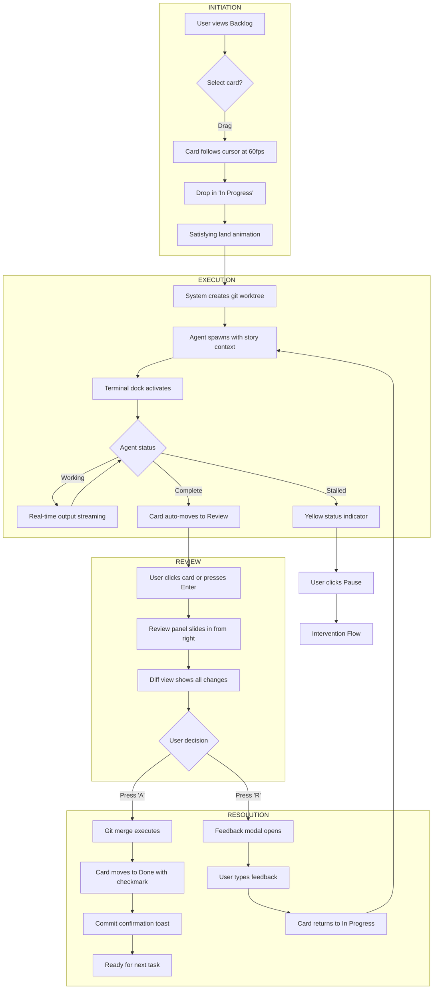
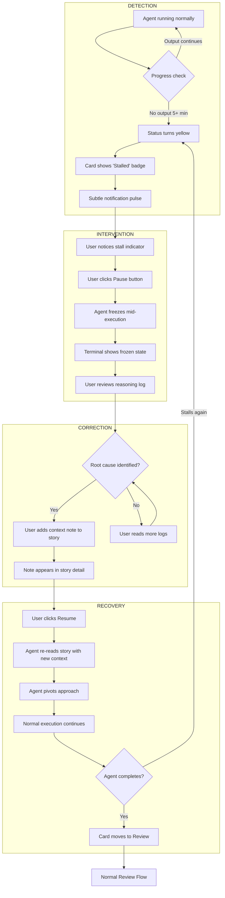
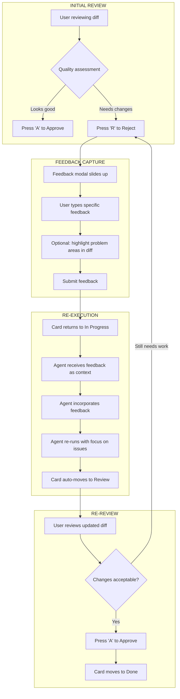

# UX Design Specification: TinSu

**Author:** Tinxu
**Date:** 2026-01-03

---

## Executive Summary

### Project Vision

TinSu transforms the chaos of "vibe coding" into structured, trustworthy product development. It's a Kanban board where tasks don't just get tracked — they get executed by AI agents under human oversight. The core promise: **review in 10 minutes what would have taken 3 hours to build manually**, while maintaining complete trust through mandatory human approval gates.

The product delivers on two equal value propositions:

1. **Time Saved** — AI agents do the work while you manage the process
2. **Trust Gained** — Nothing ships without your eyes on it

### Target Users

**Primary: The Technical Startup Founder ("The Builder")**

- Ex-engineer or self-taught developer building with AI assistance
- Frustrated that powerful tools live in the terminal with no visibility
- Wants a visual command center to see progress at a glance
- Needs ability to intervene (pause/resume) even when away from laptop

**Secondary: The Non-Technical Startup Founder ("The Visionary")**

- Business/marketing expert without coding skills
- Blocked by technical barriers from accessing powerful AI workflows
- Wants the same structured, trustworthy AI experience without terminal dependency

### Key Design Challenges

1. **Trust Through Transparency** — Balance visibility with velocity. Too much transparency breaks "time saved"; too little breaks trust. Design for progressive disclosure.

2. **Teammate, Not Machine** — Terminal view should feel like watching a colleague work. Human-readable updates, personality in communication, ability to "tap shoulder" (pause).

3. **Control From Anywhere** — Mobile/responsive isn't just viewing, it's acting. Pause/intervene must be thumb-friendly and fast.

4. **The Review Bottleneck** — Manager-in-the-Loop is the trust engine, but must not become a velocity killer. Approval should feel like a 30-second glance.

### Design Opportunities

1. **The Overnight Report** — Wake up to a summary of what agents accomplished while you slept, what's ready for review, and what needs your input.

2. **The Trust Gradient** — Adaptive transparency that learns user behavior. Power users get fast-track options; new users get more visibility.

3. **The Pause That Saves** — Make the intervention moment feel powerful and calm, not panicked. One tap stops agent spirals before they burn tokens.

## Core User Experience

### Defining Experience

The core TinSu experience is **The 60-Second Velocity Loop**:

1. **Review** — Scan the diff, see what the agent built
2. **Approve** — One keystroke (`A`) to approve
3. **Commit** — Git merge happens automatically, you see the commit confirmation
4. **Next** — Drag (or keystroke) the next card to In Progress
5. **Go** — Agent spins up with full context, you move on

This loop is the heartbeat of the product. Every design decision optimizes for making this loop feel effortless, fast, and satisfying.

### Platform Strategy

| Aspect                 | Decision                       | Rationale                                                     |
| ---------------------- | ------------------------------ | ------------------------------------------------------------- |
| **Primary Platform**   | Desktop Web                    | Deep work requires screen real estate                         |
| **Secondary Platform** | Responsive/Mobile              | Intervention capability when away                             |
| **Input Mode**         | Keyboard-first, mouse-friendly | Power users want speed; new users want discoverability        |
| **Window Strategy**    | Single docked interface        | Terminal, board, review all visible without context-switching |
| **Dark Mode**          | Nice-to-have for MVP           | Developer preference, but not blocking                        |

### Effortless Interactions

These interactions should feel invisible — they "just happen":

| Interaction                | What Happens Automatically                                                                           |
| -------------------------- | ---------------------------------------------------------------------------------------------------- |
| **Context Loading**        | Agent receives story details, architecture decisions, and relevant history without manual copy-paste |
| **Card State Transitions** | When agent completes, card moves to Review automatically                                             |
| **Git Operations**         | Worktree creation, branch naming, merge on approve — all invisible to user                           |
| **Stall Detection**        | System notices agent spinning and alerts without user polling                                        |
| **Commit Messages**        | Generated from story title + acceptance criteria                                                     |

### Critical Success Moments

| Moment                  | Experience                                        | Why It Matters                                |
| ----------------------- | ------------------------------------------------- | --------------------------------------------- |
| **The First Approval**  | User approves agent work without touching code    | "This actually works" — trust is born         |
| **The Velocity Loop**   | Approve → Commit → Next in <60 seconds            | "I'm managing a team, not grinding alone"     |
| **The Overnight Check** | Wake up to 3 stories completed, ready for review  | "It worked while I slept" — leverage realized |
| **The Pause Save**      | Catch agent spiral with one click, no damage done | "I'm in control" — trust reinforced           |

### Experience Principles

1. **The 60-Second Loop** — Every interaction optimizes for: Approve → Commit → Next → Go. Friction is a bug.

2. **Keyboard-First, Mouse-Friendly** — Power users never leave the keyboard. `A` to approve, `R` to reject, arrows to navigate. But visual UI remains intuitive for mouse users.

3. **Docked, Not Scattered** — Single window contains board, terminal, and review panel. No alt-tabbing, no lost context.

4. **Invisible Git** — Branches, worktrees, and merges are implementation details. User sees outcomes (commits), not operations.

5. **Progressive Disclosure** — Calm surface, depth on demand. Status at a glance; details one click away.

## Desired Emotional Response

### Primary Emotional Goals

**Core Emotion: "Leverage Without Anxiety"**

TinSu's emotional promise is the feeling of a confident manager — someone who has a tireless team working for them, but never feels out of control. Users should feel:

1. **Empowered** — "I have a team now, not just tools"
2. **In Control** — "Nothing happens without my approval"
3. **Productive** — "I'm accomplishing more than ever before"
4. **Calm** — "Even when things go wrong, I can handle it"

### Emotional Journey Mapping

| Stage                  | Target Emotion                                             | Avoid                         |
| ---------------------- | ---------------------------------------------------------- | ----------------------------- |
| **First Discovery**    | Intrigued — "This looks familiar but... it _does_ things?" | Overwhelmed, skeptical        |
| **First Agent Run**    | Engaged — Watching a teammate work, hopeful                | Nervous, uncertain            |
| **First Review**       | Confident — "I can actually trust this"                    | Doubtful, nitpicky            |
| **The 60-Second Loop** | Powerful — In the zone, momentum, velocity                 | Rushed, pressured             |
| **When Agent Stalls**  | Calm — "I've got this, one click to pause"                 | Panicked, frustrated          |
| **Overnight Check**    | Delighted — "It worked while I slept"                      | Anxious about what went wrong |
| **Daily Return**       | Anticipation — Excited to see progress                     | Dread, "what broke?"          |

### Micro-Emotions

**Critical Emotional States to Cultivate:**

| Emotion            | Priority  | Design Implication                                      |
| ------------------ | --------- | ------------------------------------------------------- |
| **Confidence**     | Essential | Clear status, predictable behavior, no surprises        |
| **Trust**          | Essential | Transparency in agent reasoning, mandatory review gates |
| **Accomplishment** | High      | Celebrate completions, show velocity metrics            |
| **Control**        | Essential | Pause always available, intervention feels powerful     |

### Emotions to Actively Avoid

These toxic emotions must be designed against:

| Toxic Emotion           | What Triggers It                 | How We Prevent It                                      |
| ----------------------- | -------------------------------- | ------------------------------------------------------ |
| **Token Anxiety**       | "How much is this costing?"      | Budget visibility, cost-per-task shown, caps available |
| **Black Box Dread**     | "What is it even doing?"         | Human-readable status, reasoning logs on demand        |
| **Quality Paranoia**    | "Did it mess something up?"      | Diff view shows ALL changes, nothing hidden            |
| **Babysitting Fatigue** | "I'm watching more than working" | Stall detection, notifications, trust gradient         |

### Emotional Design Principles

1. **Calm Confidence Over Flashy Alerts** — Notifications inform, never alarm. Status indicators are ambient, not aggressive.

2. **Intervention = Power, Not Panic** — The Pause button is a hero moment. Stopping an agent should feel like a manager saying "hold on" — calm authority, not emergency brake.

3. **Celebrate Velocity** — Every approval should feel like a small win. The Done column should feel satisfying to watch grow.

4. **Trust Through Transparency** — Show the reasoning, not just the result. Users trust what they can see.

5. **No Surprises** — The system should be predictable. Same input = same behavior. Users know what to expect.

## UX Pattern Analysis & Inspiration

### Inspiring Products Analysis

**Primary Inspiration: Trello**

- Dead-simple Kanban that feels instant and tactile
- Card drag is immediate (no loading states)
- Minimal UI chrome — board is 95% content
- Color labels provide glanceable status without text

**Secondary Inspiration: Asana**

- Task detail slide-over keeps board context visible
- Excellent keyboard navigation (Tab, Enter, Escape)
- Clear hierarchy visibility (Project → Section → Task)
- Subtask progress indicators on card face

**Tertiary Inspiration: Developer Tools**

- GitHub PR Reviews: Diff view, approve/request changes flow
- Vercel: Real-time deployment logs, satisfying completion moments
- VS Code: Docked terminal, split panes, command palette

### Transferable UX Patterns

**Navigation Patterns:**

- Slide-over detail panel (Asana) — Review panel slides in without losing board context
- Keyboard-first navigation (Linear/Asana) — Full workflow without touching mouse

**Interaction Patterns:**

- Optimistic UI (Trello) — Card moves instantly, server syncs in background
- Real-time streaming (Vercel) — Terminal output appears character-by-character
- Color-coded status (Trello) — Agent state visible without reading text

**Visual Patterns:**

- Minimal chrome (Trello) — Let the board breathe, dock terminal unobtrusively
- Hierarchy breadcrumbs (Asana) — Sprint → Epic → Story always visible
- Progress indicators (Asana) — Agent progress on card face

### Anti-Patterns to Avoid

| Anti-Pattern                 | Why to Avoid                                           |
| ---------------------------- | ------------------------------------------------------ |
| **Loading spinners on drag** | Breaks instant feel, creates doubt                     |
| **Confirmation modals**      | "Are you sure?" dialogs kill velocity                  |
| **Cluttered card face**      | Can't scan board at a glance                           |
| **Hidden agent status**      | Builds anxiety if you can't see state without clicking |
| **Polling-based updates**    | Terminal must stream in real-time, not refresh         |

### Design Inspiration Strategy

**Core UX Mandate: Responsiveness on Every Action**

| Interaction        | Target           | How                                        |
| ------------------ | ---------------- | ------------------------------------------ |
| Card drag          | < 16ms (60fps)   | Optimistic UI, no server round-trip        |
| Approve/Reject     | < 100ms feedback | Instant button state, async git operations |
| Card state change  | < 200ms          | Immediate column move, streaming status    |
| Terminal output    | Real-time        | WebSocket streaming, zero polling          |
| Keyboard shortcuts | < 50ms           | No debounce on A, R, arrow keys            |

**What to Adopt:**

- Trello's instant drag-drop and minimal chrome
- Asana's slide-over panels and keyboard navigation
- Real-time streaming from developer tools

**What to Adapt:**

- Asana's hierarchy for Sprint/Epic/Story structure
- GitHub's diff view for the review panel

**What to Avoid:**

- Enterprise PM tool patterns (loading states, modals, clutter)
- Polling-based updates (must be WebSocket streaming)

## Design System Foundation

### Design System Choice

**Selected: shadcn/ui (Tailwind CSS + Radix UI primitives)**

A modern, copy-paste component library that gives you ownership of your code while leveraging battle-tested accessibility primitives. Components are copied into your codebase, not installed as dependencies — you own and customize everything.

### Rationale for Selection

| Requirement                             | How shadcn/ui Delivers                                               |
| --------------------------------------- | -------------------------------------------------------------------- |
| **Responsiveness (<16ms interactions)** | Built on Radix — minimal JS, no unnecessary re-renders               |
| **Keyboard-first navigation**           | Radix primitives have excellent keyboard/focus management            |
| **Trello-like minimal aesthetic**       | Unstyled foundation — you control every visual detail                |
| **Developer audience appeal**           | Linear/Vercel aesthetic that developers trust and love               |
| **MVP velocity**                        | Copy-paste production-ready components, iterate fast                 |
| **No lock-in**                          | You own the code — modify freely, no library updates to break things |
| **Dark mode support**                   | Built-in CSS variable theming for light/dark modes                   |

### Implementation Approach

**Core Stack:**

- **Tailwind CSS** — Utility-first styling, rapid iteration
- **Radix UI** — Accessible primitives (Dialog, Dropdown, Tooltip, etc.)
- **shadcn/ui components** — Pre-built, customizable starting points
- **CSS Variables** — Design tokens for consistent theming

**Component Strategy:**

| Component Type                                  | Approach                                |
| ----------------------------------------------- | --------------------------------------- |
| **Standard UI** (buttons, inputs, dialogs)      | Use shadcn/ui components directly       |
| **Kanban-specific** (cards, columns, drag-drop) | Custom components using Tailwind        |
| **Terminal view**                               | Custom component with monospace styling |
| **Diff viewer**                                 | Custom or adapt existing diff library   |

### Customization Strategy

**Design Tokens to Define:**

| Token Category     | Purpose                |
| ------------------ | ---------------------- |
| `--primary`        | Brand accent color     |
| `--background`     | Board background       |
| `--card`           | Card surface           |
| `--muted`          | Subtle backgrounds     |
| `--border`         | Subtle dividers        |
| `--status-running` | Agent actively working |
| `--status-stalled` | Warning state          |
| `--status-review`  | Ready for approval     |
| `--status-done`    | Completed              |
| `--success`        | Approve actions        |
| `--warning`        | Stall alerts           |
| `--destructive`    | Reject/error states    |

**Typography:**

- System font stack for speed and native feel
- Monospace for terminal output (JetBrains Mono or similar)
- Clear hierarchy: Board title → Column headers → Card titles → Card metadata

**Spacing & Layout:**

- Consistent 4px grid system
- Generous whitespace for minimal chrome aesthetic
- Responsive breakpoints for intervention-capable mobile view

## Defining Experience

### The Core Interaction

**"Drag to start, approve to ship."**

This six-word phrase captures TinSu's entire value proposition. Two actions, complete workflow:

1. **Drag** — Move a card to "In Progress" to delegate work to an AI agent
2. **Approve** — Review the agent's output and ship it with one keystroke

This is the interaction users will describe to friends: _"I drag a task, my AI builds it, I approve and ship. That's it."_

### User Mental Model

**How Users Think About TinSu:**

| Mental Model                | Implication for Design                                           |
| --------------------------- | ---------------------------------------------------------------- |
| "Trello, but cards do work" | Familiar interface, unfamiliar capability — leverage recognition |
| "Drag = delegate"           | Dragging must feel like handing off, not just organizing         |
| "Approve = ship"            | Approval must feel consequential — code actually merges          |
| "I'm the manager"           | UI should feel like oversight, not operation                     |

**Potential Confusion Points:**

| Moment       | Risk                     | Mitigation                                         |
| ------------ | ------------------------ | -------------------------------------------------- |
| First drag   | "Wait, it just started?" | Satisfying animation + "Agent started" toast       |
| First review | "Is this everything?"    | Comprehensive diff, file count badge               |
| First stall  | "Is it broken?"          | Clear status differentiation (working vs. stalled) |

### Success Criteria

| Criteria                  | Target                      | Why It Matters                    |
| ------------------------- | --------------------------- | --------------------------------- |
| **Drag feels instant**    | < 16ms visual response      | Optimistic UI, no doubt it worked |
| **Agent starts fast**     | < 2 seconds to first output | Immediate feedback builds trust   |
| **Diff is comprehensive** | 100% of changes visible     | No "what did it do?" anxiety      |
| **Loop is fast**          | < 60 seconds Approve → Next | Velocity feeling realized         |
| **Approval rate high**    | > 80% first-review approval | Quality output, trust earned      |

### Novel UX Patterns

**Pattern Innovation: The Card as Runtime**

TinSu combines established patterns in a novel way:

| Established Pattern | Source     | TinSu Innovation                                  |
| ------------------- | ---------- | ------------------------------------------------- |
| Drag-drop Kanban    | Trello     | Dragging _spawns work_, not just updates status   |
| Approve/Reject flow | GitHub PRs | Approval _merges code_, not just signals approval |
| Real-time logs      | Vercel/CI  | Watching a _teammate work_, not a pipeline run    |

**The key innovation:** A Kanban card is traditionally a _record_ of work to be done. In TinSu, the card is a _runtime environment_ where work actually happens. This mental shift — from tracker to executor — is the core product innovation.

### Experience Mechanics

**Phase 1: Initiation (Drag to Start)**

| Step | User Action                   | System Response                               |
| ---- | ----------------------------- | --------------------------------------------- |
| 1    | Hovers over Backlog card      | Subtle lift effect, cursor changes            |
| 2    | Drags card toward In Progress | Card follows cursor at 60fps                  |
| 3    | Drops card in In Progress     | Card lands with satisfying animation          |
| 4    | —                             | System creates git worktree (invisible)       |
| 5    | —                             | Agent spawns with full story context          |
| 6    | —                             | Terminal view activates, first output appears |

**Phase 2: Execution (Agent Works)**

| Step | System State          | User Sees                           |
| ---- | --------------------- | ----------------------------------- |
| 1    | Agent reading context | "Understanding task..." status      |
| 2    | Agent planning        | "Planning approach..." status       |
| 3    | Agent coding          | Real-time terminal output streaming |
| 4    | Agent completing      | "Finalizing..." status              |
| 5    | Agent done            | Card auto-moves to Review column    |

**Phase 3: Review (Approve to Ship)**

| Step | User Action                             | System Response                             |
| ---- | --------------------------------------- | ------------------------------------------- |
| 1    | Clicks card in Review (or keyboard nav) | Review panel slides in                      |
| 2    | Scans diff view                         | Files changed, lines added/removed visible  |
| 3    | (Optional) Expands reasoning log        | Sees agent's decision rationale             |
| 4a   | Presses `A` to Approve                  | Git merge executes, card moves to Done      |
| 4b   | Presses `R` to Reject                   | Feedback modal, card returns to In Progress |

**Phase 4: Velocity (Next Task)**

| Step | User Action                                 | System Response                       |
| ---- | ------------------------------------------- | ------------------------------------- |
| 1    | Card lands in Done                          | Subtle celebration (checkmark, color) |
| 2    | User drags next Backlog card                | Loop repeats                          |
| —    | Total time from Approve to next agent start | < 60 seconds target                   |

## Visual Design Foundation

### Color System

**Theme: "Calm Command"**

A dark, professional palette inspired by Linear and Vercel — developer-trusted, content-forward, with strategic color for status and actions.

**Base Palette:**

| Token             | Value     | Purpose                |
| ----------------- | --------- | ---------------------- |
| `--background`    | `#0a0a0b` | Board background       |
| `--card`          | `#18181b` | Card surface           |
| `--card-hover`    | `#27272a` | Card hover state       |
| `--border`        | `#27272a` | Subtle dividers        |
| `--primary`       | `#3b82f6` | Primary actions, focus |
| `--primary-hover` | `#2563eb` | Primary hover          |
| `--text`          | `#fafafa` | Primary text           |
| `--text-muted`    | `#a1a1aa` | Secondary text         |

**Status Colors:**

| Token              | Value     | Meaning          |
| ------------------ | --------- | ---------------- |
| `--status-running` | `#22c55e` | Agent working    |
| `--status-stalled` | `#f59e0b` | Needs attention  |
| `--status-review`  | `#8b5cf6` | Ready for review |
| `--status-done`    | `#6b7280` | Completed        |

**Semantic Colors:**

| Token           | Value     | Use               |
| --------------- | --------- | ----------------- |
| `--success`     | `#22c55e` | Approve, positive |
| `--warning`     | `#f59e0b` | Caution, stall    |
| `--destructive` | `#ef4444` | Reject, error     |

### Typography System

**Font Stack:**

- **UI/Headings:** Inter (or system font stack)
- **Terminal/Code:** JetBrains Mono

**Type Scale:**

| Level   | Size | Weight | Line Height | Use            |
| ------- | ---- | ------ | ----------- | -------------- |
| `h1`    | 24px | 600    | 1.2         | Board title    |
| `h2`    | 18px | 600    | 1.3         | Column headers |
| `h3`    | 14px | 500    | 1.4         | Card titles    |
| `body`  | 14px | 400    | 1.5         | General text   |
| `small` | 12px | 400    | 1.4         | Metadata       |
| `mono`  | 13px | 400    | 1.6         | Terminal       |

### Spacing & Layout Foundation

**Grid System:** 4px base unit

| Token        | Value | Use               |
| ------------ | ----- | ----------------- |
| `--space-xs` | 4px   | Tight spacing     |
| `--space-sm` | 8px   | Component padding |
| `--space-md` | 16px  | Section spacing   |
| `--space-lg` | 24px  | Major sections    |
| `--space-xl` | 32px  | Page margins      |

**Layout Structure:**

| Element            | Specification               |
| ------------------ | --------------------------- |
| **Board area**     | 90%+ of viewport            |
| **Card gap**       | 12px between cards          |
| **Column padding** | 16px                        |
| **Terminal dock**  | Bottom 30%, collapsible     |
| **Review panel**   | 400px slide-over from right |

### Accessibility Considerations

| Requirement            | Implementation                                    |
| ---------------------- | ------------------------------------------------- |
| **Contrast**           | All text meets WCAG AA (4.5:1 minimum)            |
| **Focus states**       | Visible 2px focus rings on interactive elements   |
| **Color independence** | Status indicated by icon + color, not color alone |
| **Keyboard access**    | Full workflow navigable via keyboard              |
| **Screen readers**     | Semantic HTML, ARIA labels where needed           |
| **Motion**             | Respect `prefers-reduced-motion` for animations   |

## Design Direction Decision

### Design Directions Explored

Six distinct visual approaches were evaluated for TinSu:

| Direction       | Focus                              | Trade-off                      |
| --------------- | ---------------------------------- | ------------------------------ |
| Classic Kanban  | Familiar layout, balanced elements | Standard approach              |
| Wide Cards      | More detail per card               | Fewer cards visible            |
| Compact Density | Maximum task visibility            | Less detail per card           |
| Terminal Focus  | Agent work prominence              | Less board real estate         |
| Split View      | Always-on review panel             | Fixed layout, less flexibility |
| Minimal Chrome  | Content-forward, light UI          | Less visual structure          |

### Chosen Direction

**Primary: Direction 1 — Classic Kanban**
**Enhancement: Direction 4 — Larger Terminal Dock**

This hybrid approach combines the familiar, instant-recognition Kanban layout with enhanced terminal visibility for users who want to "watch the teammate work."

### Design Rationale

| Decision                            | Rationale                                                  |
| ----------------------------------- | ---------------------------------------------------------- |
| **Classic 4-column Kanban**         | Trello mental model = zero learning curve for target users |
| **Larger terminal (30-40% height)** | Supports "teammate not machine" emotional goal             |
| **Slide-over review panel**         | Maintains board context during approval loop               |
| **Cards with status badges**        | Glanceable agent state without clicking                    |
| **Collapsible terminal**            | User control over visibility based on trust level          |

### Key Layout Specifications

| Element            | Specification                                              |
| ------------------ | ---------------------------------------------------------- |
| **Board columns**  | 4 equal-width columns (Backlog, In Progress, Review, Done) |
| **Card height**    | Auto-sized based on content, ~80-100px typical             |
| **Card gap**       | 12px between cards                                         |
| **Column padding** | 16px                                                       |
| **Terminal dock**  | Bottom 30-40% of viewport, collapsible to 80px             |
| **Review panel**   | 400px slide-over from right, overlay on board              |
| **Header**         | 48px fixed, contains logo, breadcrumb, shortcuts hint      |

### Implementation Approach

**Phase 1: Core Layout**

- Implement 4-column Kanban with drag-drop (using @dnd-kit or similar)
- Add card components with status badge variants
- Build collapsible terminal dock with WebSocket streaming

**Phase 2: Review Flow**

- Implement slide-over review panel with diff view
- Add keyboard shortcuts (A/R for approve/reject)
- Connect approval action to git merge

**Phase 3: Polish**

- Add micro-animations (card lift, drop, column transitions)
- Implement focus management for keyboard navigation
- Add responsive breakpoints for intervention-capable mobile view

## User Journey Flows

### The Velocity Loop (Happy Path)

The core "60-Second Velocity Loop" defines TinSu's primary user experience:

**Flow Phases:**

1. **Initiation** — User drags card from Backlog to In Progress
2. **Execution** — Agent spawns with context, works in isolated worktree
3. **Review** — Card auto-moves to Review, user opens diff panel
4. **Resolution** — User approves (merge) or rejects (feedback loop)



**Target Metrics:**

| Metric                     | Target       | Rationale                       |
| -------------------------- | ------------ | ------------------------------- |
| Drag response              | < 16ms       | 60fps feel, optimistic UI       |
| Agent first output         | < 2 seconds  | Immediate feedback builds trust |
| Approve to next drag       | < 60 seconds | Velocity feeling realized       |
| First-review approval rate | > 80%        | Quality output, trust earned    |

### The Intervention Flow (Recovery Path)

When agents stall, TinSu enables confident intervention:

**Flow Phases:**

1. **Detection** — System identifies stall (no progress for 5 minutes)
2. **Intervention** — User pauses agent, reviews reasoning logs
3. **Correction** — User adds context note to story
4. **Recovery** — Agent resumes with new context, pivots approach



**Emotional Goals:**

| Moment         | Target Emotion       | Design Implication                  |
| -------------- | -------------------- | ----------------------------------- |
| Stall detected | Attention, not alarm | Yellow (warning), not red (error)   |
| Pause action   | Confident authority  | Button feels powerful, not panicked |
| Log review     | Detective mode       | Clear, scannable reasoning history  |
| Resume         | Course correction    | Feels like guidance, not restart    |

### The Feedback Loop (Iteration Path)

When code needs changes before approval:

**Flow Phases:**

1. **Review** — User identifies issues in diff
2. **Feedback** — User provides specific feedback via modal
3. **Re-execution** — Agent incorporates feedback
4. **Re-review** — User verifies changes, approves or iterates



**Target:** Average iterations < 2 before approval

### Journey Patterns

Across all journeys, these patterns ensure consistency:

**Navigation Patterns:**

| Pattern          | Implementation                   | Use Case                   |
| ---------------- | -------------------------------- | -------------------------- |
| Card Selection   | Click or Arrow keys → Enter      | Selecting task to review   |
| Panel Slide-over | 400px from right, overlay        | Review panel, story detail |
| Tab Navigation   | Tab through interactive elements | Accessibility, power users |
| Escape to Close  | ESC dismisses overlays           | Quick dismissal            |

**Status Patterns:**

| Pattern      | Visual Treatment     | Trigger                   |
| ------------ | -------------------- | ------------------------- |
| Working      | Green pulse on card  | Agent actively outputting |
| Stalled      | Yellow badge + pulse | No output for threshold   |
| Review Ready | Purple highlight     | Agent completed           |
| Done         | Gray with checkmark  | User approved             |

**Action Patterns:**

| Pattern | Trigger                   | Feedback                      |
| ------- | ------------------------- | ----------------------------- |
| Approve | Press 'A' or click button | Instant card move + toast     |
| Reject  | Press 'R' or click button | Modal opens for feedback      |
| Pause   | Click pause icon          | Agent freezes, status updates |
| Resume  | Click resume icon         | Agent continues with context  |

**Feedback Patterns:**

| Pattern            | Type                       | Duration            |
| ------------------ | -------------------------- | ------------------- |
| Toast              | Success/info messages      | 3 seconds           |
| Status Badge       | Persistent state indicator | Until state changes |
| Pulse Animation    | Attention signal           | Until acknowledged  |
| Progress Indicator | Agent activity             | During execution    |

### Flow Optimization Principles

**1. Minimize Steps to Value**

- Drag starts execution immediately (no confirmation modal)
- Approve triggers merge automatically (no extra confirmation)
- Keyboard shortcuts bypass mouse travel entirely

**2. Reduce Cognitive Load**

- One decision at a time (Approve OR Reject, not both visible)
- Clear visual hierarchy (what needs attention is immediately obvious)
- Progressive disclosure (details available on demand, not forced)

**3. Create Delight Moments**

- Satisfying card animations on drag/drop/land
- Checkmark celebration animation on Done
- "Velocity" feeling when loop completes in <60 seconds
- Growing Done column provides visual accomplishment

**4. Enable Graceful Recovery**

- Pause always available (never locked out of intervention)
- Feedback preserves context (agent remembers previous work)
- Stall detection is proactive (system catches problems before user notices)
- Clear path from error state back to success path

## Component Strategy

### Design System Components

TinSu leverages shadcn/ui (Tailwind CSS + Radix UI) as the foundation:

**Direct Usage:**

| Component   | TinSu Usage                    | Customization              |
| ----------- | ------------------------------ | -------------------------- |
| Button      | Approve, Reject, Pause, Resume | Semantic color variants    |
| Sheet       | Review panel slide-over        | Right-side, 400px width    |
| Dialog      | Feedback modal, confirmations  | Minimal chrome             |
| Toast       | Success/error notifications    | 3-second, bottom-right     |
| Badge       | Status indicators              | Agent state color variants |
| Tooltip     | Action hints, shortcuts        | Consistent delay           |
| Command     | Keyboard shortcut palette      | TinSu commands             |
| Scroll Area | Terminal, diff containers      | Custom scrollbar           |

**Customization Approach:**

- Button variants for Approve (success), Reject (destructive), Pause (warning)
- Badge variants for agent status colors (running, stalled, review, done)
- Sheet configured as right-side 400px slide-over panel

### Custom Components

#### KanbanBoard

**Purpose:** Primary workspace — visual command center for all tasks

**Structure:**

- 4 columns: Backlog, In Progress, Review, Done
- Task cards with status, title, sprint/epic hierarchy
- Column headers with task counts

**Implementation:** @dnd-kit for drag-drop, Tailwind for styling

**States:** Default, Dragging (lifted card + placeholder), Drop Target (highlight)

#### KanbanColumn

**Purpose:** Container for tasks in a specific status

**Variants:**
| Variant | Styling |
|---------|---------|
| Backlog | Default gray header |
| In Progress | Green accent |
| Review | Purple accent |
| Done | Muted gray + checkmark |

**Accessibility:** ARIA `role="listbox"` with count announcements

#### TaskCard

**Purpose:** The "runtime unit" — represents a task that agents can execute

**Content:** Story title, epic label, status badge, progress indicator

**States:**
| State | Visual Treatment |
|-------|------------------|
| Idle | Default card surface |
| Running | Green pulse, progress indicator |
| Stalled | Yellow badge, attention pulse |
| Review | Purple highlight |
| Done | Checkmark overlay, muted |
| Dragging | Lifted with shadow |
| Hover | Subtle lift, border highlight |
| Focused | Primary focus ring |

**Accessibility:** ARIA `role="option"`, full keyboard navigation

#### TerminalDock

**Purpose:** Real-time view of agent execution — "watching a teammate work"

**Implementation:** xterm.js wrapper with WebSocket streaming

**Layout:**

- Collapsed: 80px bar with status summary
- Expanded: 30-40% viewport height

**Controls:** Collapse/Expand, Pause/Resume, Copy output

**States:** Idle, Streaming (live output), Paused, Complete

#### ReviewPanel

**Purpose:** Manager-in-the-Loop approval interface — the trust engine

**Layout:** 400px slide-over from right edge, overlay on board

**Content:**

- Task title and context
- DiffViewer (files changed, lines added/removed)
- Agent reasoning log (collapsible)
- Approve/Reject actions

**Keyboard:** A to approve, R to reject, ESC to close

**Accessibility:** Focus trap, keyboard shortcuts, screen reader diff summary

#### DiffViewer

**Purpose:** Show all changes made by agent — transparency for trust

**Content:**

- File list with change counts
- Line-by-line diff with syntax highlighting
- Added (green), removed (red), unchanged (gray)

**Implementation:** react-diff-viewer or custom component

**Variants:** Unified (interleaved), Split (side-by-side), Compact (collapsed)

#### AgentStatusBadge

**Purpose:** Glanceable agent state on card face

**Variants:**
| Variant | Color | Icon | Meaning |
|---------|-------|------|---------|
| Idle | Gray | Circle | Ready to start |
| Running | Green | Spinner | Agent working |
| Stalled | Yellow | Warning | Needs attention |
| Review | Purple | Eye | Awaiting approval |
| Done | Green | Check | Completed |
| Error | Red | X | Failed |

**Accessibility:** Icon + color (not color alone), tooltip with status text

### Component Implementation Strategy

**Foundation Layer:**

- shadcn/ui components with TinSu design tokens
- CSS variables for consistent theming

**Custom Layer:**

- Built on Radix primitives for accessibility
- Tailwind utilities for styling consistency

**Real-time Layer:**

- WebSocket integration for terminal streaming
- Optimistic UI updates for instant feedback

**Accessibility Layer:**

- Keyboard navigation throughout
- ARIA labels and live regions
- Focus management for overlays

### Implementation Roadmap

**Phase 1 — Core (MVP Critical Path):**

| Component    | Enables          | Dependencies |
| ------------ | ---------------- | ------------ |
| TaskCard     | Card visibility  | None         |
| KanbanColumn | Board structure  | TaskCard     |
| KanbanBoard  | "Drag to start"  | KanbanColumn |
| TerminalDock | Agent visibility | WebSocket    |

**Phase 2 — Review Flow:**

| Component        | Enables           | Dependencies |
| ---------------- | ----------------- | ------------ |
| ReviewPanel      | Approval workflow | Phase 1      |
| DiffViewer       | Change visibility | ReviewPanel  |
| AgentStatusBadge | Glanceable state  | TaskCard     |

**Phase 3 — Polish & Enhancement:**

| Component        | Enhances               | Priority |
| ---------------- | ---------------------- | -------- |
| Breadcrumb Nav   | Sprint/Epic visibility | Medium   |
| Agent Progress   | Running state detail   | Medium   |
| Reasoning Log    | Trust transparency     | Medium   |
| Velocity Metrics | Done column stats      | Lower    |

## UX Consistency Patterns

### Action Hierarchy

**Button Types:**

| Type        | Color                 | Use Case                      | Example               |
| ----------- | --------------------- | ----------------------------- | --------------------- |
| Primary     | Blue (`--primary`)    | Main action, forward progress | "Start Agent", "Save" |
| Success     | Green (`--success`)   | Approval, positive action     | "Approve"             |
| Destructive | Red (`--destructive`) | Rejection, deletion           | "Reject", "Delete"    |
| Warning     | Yellow (`--warning`)  | Pause, caution                | "Pause Agent"         |
| Ghost       | Transparent           | Secondary actions             | "Cancel", "Close"     |

**Action Placement:**

- Primary actions go right, secondary go left
- Destructive actions require confirmation only for irreversible operations

**Keyboard Shortcuts:**

| Shortcut | Action              | Context           |
| -------- | ------------------- | ----------------- |
| `A`      | Approve             | Review panel open |
| `R`      | Reject              | Review panel open |
| `Enter`  | Open selected       | Card focused      |
| `Escape` | Close overlay       | Any overlay open  |
| `Space`  | Toggle pause/resume | Agent running     |
| `←` `→`  | Navigate columns    | Board focused     |
| `↑` `↓`  | Navigate cards      | Column focused    |
| `?`      | Show shortcuts      | Global            |

### Agent Status Feedback

**Status Transitions:**

```
Idle → Running → [Stalled | Complete] → Review → Done
        ↑_______________|
        (Resume after pause)
```

**Status Indicator Hierarchy:**

| Level           | Visual                     | Purpose               |
| --------------- | -------------------------- | --------------------- |
| Card Badge      | Icon + color on card       | Glanceable state      |
| Terminal Header | Status text + elapsed time | Detail while watching |
| Toast           | Temporary notification     | State changes         |
| Column Count    | Number in header           | Overview              |

**Communication Style:**

| State    | Tone             | Example                                  |
| -------- | ---------------- | ---------------------------------------- |
| Running  | Progress-focused | "Implementing login flow..."             |
| Stalled  | Calm alert       | "No progress for 5 minutes"              |
| Complete | Accomplished     | "Ready for review"                       |
| Approved | Celebratory      | "Merged to main!"                        |
| Error    | Helpful          | "Agent encountered an error. View logs." |

### Toast & Notification Patterns

**Toast Types:**

| Type    | Color  | Duration    | Use Case                  |
| ------- | ------ | ----------- | ------------------------- |
| Success | Green  | 3s          | "Changes approved"        |
| Error   | Red    | 5s (sticky) | "Merge conflict detected" |
| Warning | Yellow | 4s          | "Agent stalled"           |
| Info    | Blue   | 3s          | "Agent started"           |

**Placement & Behavior:**

- Position: Bottom-right corner
- Stack: New toasts push old ones up
- Max visible: 3 (older auto-dismiss)
- Mobile: Full-width at bottom

**Content Guidelines:**

- Keep under 60 characters
- Include action when applicable ("Undo" for reversible)
- Use active voice

### Modal & Overlay Patterns

**Overlay Types:**

| Type    | Size      | Position     | Use Case                     |
| ------- | --------- | ------------ | ---------------------------- |
| Sheet   | 400px     | Right edge   | Review panel, story detail   |
| Dialog  | 480px max | Center       | Feedback input, confirmation |
| Popover | Auto      | Near trigger | Quick actions, hints         |
| Command | 480px     | Top-center   | Keyboard shortcut search     |

**Behavior Rules:**

- Close: ESC key, click outside, or close button
- Focus: Trapped within overlay when open
- Return: Focus returns to trigger on close

**Z-Index Hierarchy:**

| Layer    | Z-Index | Element                 |
| -------- | ------- | ----------------------- |
| Base     | 0       | Board, columns, cards   |
| Dropdown | 50      | Context menus, popovers |
| Dock     | 100     | Terminal dock           |
| Overlay  | 200     | Sheet, backdrop         |
| Modal    | 300     | Dialogs                 |
| Toast    | 400     | Notifications           |
| Command  | 500     | Command palette         |

### Empty & Loading States

**Empty States:**

| Context           | Message                               | Action               |
| ----------------- | ------------------------------------- | -------------------- |
| Empty Backlog     | "No tasks yet. Add your first story!" | "Add Story" button   |
| Empty In Progress | "Drag a task here to start working"   | None (instructional) |
| Empty Review      | "No tasks waiting for review"         | None                 |
| Empty Done        | "Completed tasks will appear here"    | None                 |

**Loading States:**

| Context       | Pattern                    | Target  |
| ------------- | -------------------------- | ------- |
| Initial board | Skeleton cards             | <1s     |
| Card drag     | Optimistic (no loading)    | Instant |
| Review panel  | Skeleton for diff          | <500ms  |
| Terminal      | "Connecting..."            | <2s     |
| Agent start   | Card pulse + "Starting..." | <2s     |

### Form Patterns

**Input States:**

| State    | Border          | Background |
| -------- | --------------- | ---------- |
| Default  | `--border`      | `--card`   |
| Focus    | `--primary`     | `--card`   |
| Error    | `--destructive` | `--card`   |
| Disabled | 50% opacity     | `--muted`  |

**Validation Timing:**

- Required fields: On blur (first), then on change
- Format validation: On blur
- Async validation: On blur with debounce

**Error Display:**

- Position: Inline below field
- Style: Red text with icon
- Behavior: Clear when corrected

### Navigation Patterns

**Keyboard Navigation Flow:**

```
Tab order: Header → Column 1 → ... → Column 4 → Terminal → Footer
Arrow keys: ← → between columns, ↑ ↓ within column
```

**Focus Management:**

- Visible focus ring: 2px `--primary` with 2px offset
- Focus trap in modals/sheets
- Return focus to trigger on close
- Respect `prefers-reduced-motion` for animations

## Responsive Design & Accessibility

### Responsive Strategy

**Approach:** Desktop-first with mobile intervention capability

| Viewport            | Primary Use        | Layout                                 |
| ------------------- | ------------------ | -------------------------------------- |
| Desktop (1024px+)   | Full workflow      | 4-column board + docked terminal       |
| Tablet (768-1023px) | Quick intervention | 2-column board, swipe for more columns |
| Mobile (320-767px)  | Emergency actions  | Single card view, Review + Pause focus |

**Desktop Layout:**

- 4 equal-width columns (Backlog, In Progress, Review, Done)
- Docked terminal at bottom (30-40% height, collapsible)
- Review panel slides over from right (400px)

**Tablet Layout:**

- 2 columns visible, horizontal swipe for more
- Terminal collapsed by default, quick-access controls visible
- Touch-optimized card interactions

**Mobile Layout:**

- Single card focus with priority on Review tasks
- Bottom action bar for Approve/Reject/Pause
- Terminal status visible, expand on tap

### Breakpoint Strategy

| Breakpoint | Name          | Key Changes                                     |
| ---------- | ------------- | ----------------------------------------------- |
| `375px`    | Mobile        | Single column, minimal UI, bottom actions       |
| `768px`    | Tablet        | 2-column board, collapsible terminal            |
| `1024px`   | Desktop       | Full 4-column + docked terminal                 |
| `1440px`   | Large Desktop | Enhanced spacing, larger cards                  |
| `1920px`   | Extra Large   | Optional split view with permanent review panel |

**Typography Scaling:**

| Element | Mobile | Desktop |
| ------- | ------ | ------- |
| h1      | 20px   | 24px    |
| h2      | 16px   | 18px    |
| h3/body | 14px   | 14px    |
| mono    | 12px   | 13px    |

### Accessibility Strategy

**Target:** WCAG 2.1 Level AA

**Color Contrast Compliance:**

| Element                    | Ratio  | Status |
| -------------------------- | ------ | ------ |
| Primary text on background | 19.6:1 | ✅ AAA |
| Muted text on background   | 7.2:1  | ✅ AA  |
| Card text on card          | 15.6:1 | ✅ AAA |
| Status colors on card      | 5.4:1+ | ✅ AA  |

**Keyboard Navigation:**

| Action           | Keys       |
| ---------------- | ---------- |
| Navigate board   | Arrow keys |
| Select/Open card | Enter      |
| Approve          | A          |
| Reject           | R          |
| Close overlay    | Escape     |
| Pause/Resume     | Space      |
| Show shortcuts   | ?          |

**Screen Reader Support:**

- ARIA roles: `application` (board), `listbox` (columns), `option` (cards), `log` (terminal), `dialog` (panels)
- Live regions for toasts (`polite`) and status changes (`assertive`)
- Descriptive labels: "Backlog column, 5 tasks", "Task: Implement login, Running"

**Focus Management:**

- 2px solid `--primary` with 2px offset on all focusable elements
- Focus trap in modals and sheets
- Skip links: "Skip to board", "Skip to terminal"
- Return focus to trigger on overlay close

### Testing Strategy

**Automated Testing:**

- axe-core accessibility checks in CI/CD pipeline
- Lighthouse audits for performance and accessibility
- Playwright tests with accessibility assertions

**Manual Testing:**

- Keyboard-only navigation testing for every component
- Screen reader testing with VoiceOver (macOS) and NVDA (Windows)
- Color contrast verification in design phase

**Device Testing Matrix:**

- iPhone SE (smallest mobile)
- iPhone 14 Pro (standard mobile)
- iPad (tablet)
- MacBook 13" (small desktop)
- 27" monitor (large desktop)

### Implementation Guidelines

**Responsive Development:**

- Use relative units (rem, %, vw, vh) over fixed pixels
- Mobile-first media queries with Tailwind breakpoints
- Minimum 44x44px touch targets on all interactive elements
- Test at each breakpoint during development

**Accessibility Development:**

- Semantic HTML structure (nav, section, article, button)
- ARIA labels only where semantic HTML is insufficient
- Never remove focus outlines — style them appropriately
- Support `prefers-reduced-motion` for animations
- Test with keyboard before considering component complete

**Code Examples:**

```css
/* Focus visible - never hide */
:focus-visible {
  outline: 2px solid var(--primary);
  outline-offset: 2px;
}

/* Reduced motion support */
@media (prefers-reduced-motion: reduce) {
  * {
    animation-duration: 0.01ms !important;
    transition-duration: 0.01ms !important;
  }
}
```
