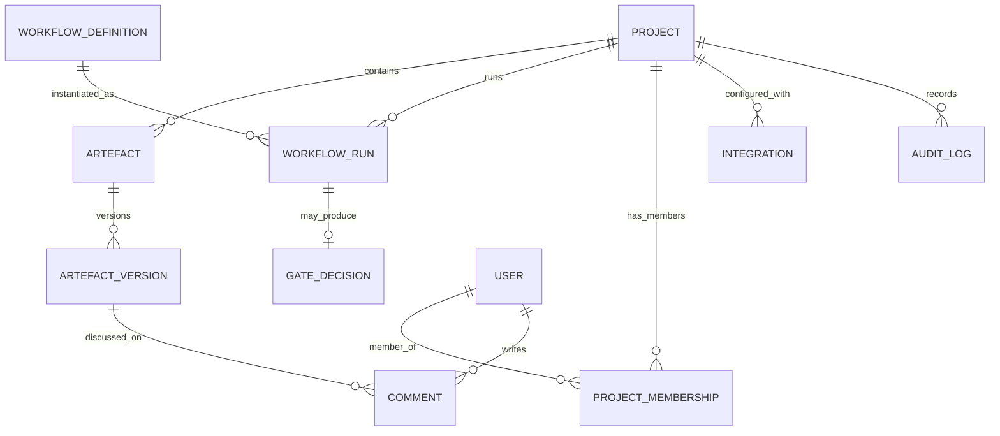
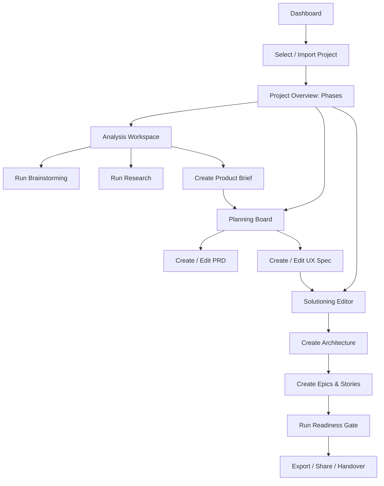

# Planning GUI for the BMad Method

## Executive summary

The BMad Method’s planning system is intentionally document-driven: each planning workflow produces a small set of canonical artefacts (e.g., *product-brief.md*, *PRD.md*, *ux-spec.md*, *architecture.md*, epic/story files) that progressively become context for downstream work. The official Workflow Map explicitly frames this as “context engineering” where artefacts flow phase-to-phase and prevent inconsistent agent decisions. citeturn2view0turn15view0turn1view2

A web app that acts as a GUI alternative to the CLI/terminal experience should therefore optimise for: (a) making the workflow map legible and actionable for non-terminal users; (b) providing structured editing and review for the planning artefacts with clear states (draft → review → approved); (c) running or *emulating* BMad’s “skill-based” workflows as guided, step-by-step “runs” that produce BMad-compatible files in the expected locations; and (d) capturing provenance (what inputs were used, who approved, and what changed between versions). Skills in BMad are themselves generated at install time from module manifests and are stored inside IDE-specific folders (e.g., `.claude/skills/`, `.cursor/skills/`), which offers a practical path to discover available workflows for the GUI without hard-coding them. citeturn7view0turn12view0

A robust architecture typically becomes two-tier:

A browser-first GUI for navigating phases, editing markdown, reviewing diffs, and coordinating collaboration; plus a “runner” layer that bridges to (1) the BMad installer/CLI for project setup (`npx bmad-method install` with non-interactive flags) and (2) workflow execution, either by orchestrating an LLM directly or by producing BMad-compatible prompts/runs and writing the artefacts to `_bmad-output/planning-artifacts/`. citeturn12view0turn4view0turn2view0turn7view0

For MVP scope, the highest-leverage subset is: project import + workspace setup, workflow-guided creation of `product-brief.md`, `PRD.md`, and `architecture.md`, a simple epics/story breakdown editor, versioned artefacts with diffing, and a “BMad-Help-like” “What next?” recommender that scans the project state and suggests the next workflow step. BMad’s own `bmad-help` tool is defined as scanning artefacts and installed modules to recommend next steps; that same pattern ports well into a GUI. citeturn16view0turn4view0turn7view0

## BMad-method workflow synthesis for analysis, planning, and solutioning

### The planning phases and the philosophy of progressive context

Official docs define four phases (Analysis, Planning, Solutioning, Implementation) and emphasise that the system “builds [the] context progressively across 4 distinct phases,” where each workflow produces documents that inform the next. citeturn2view0turn4view0turn15view0

The workflow diagram (V6) makes the artefact flow explicit: Analysis outputs feed Planning; Planning outputs (plus optional UX) feed Solutioning; Solutioning outputs feed Implementation; and there is also a “Quick Flow” that bypasses phases 1–3 for small changes. citeturn15view0turn2view0turn14view0

### Phase-level synthesis and key artefacts/commands

BMad workflows are invoked primarily as **skills** (e.g., type `bmad-create-prd` in an AI IDE) or via **agent menu triggers** (short codes after loading an agent). The docs stress that skills directly load agents/workflows/tasks and that skills are generated by the installer from module manifests. citeturn7view0turn12view0

Within the **planning scope** (Analysis, Planning, Solutioning), the Workflow Map lists the canonical workflows, purposes, and produced artefacts:

**Analysis (optional): explore and validate before commitment**

The Workflow Map describes Analysis as exploring the problem space and validating ideas before planning. Its workflows and outputs are:  
- `bmad-brainstorming` → `brainstorming-report.md` citeturn2view0turn15view0  
- research workflows (`bmad-domain-research`, `bmad-market-research`, `bmad-technical-research`) → research findings citeturn2view0  
- `bmad-create-product-brief` → `product-brief.md` citeturn2view0turn15view0  

**Planning: define what to build and for whom**

Planning is framed as defining requirements (functional and non-functional) and optionally designing user experience. Workflows and outputs are:  
- `bmad-create-prd` → `PRD.md` citeturn2view0turn4view0  
- `bmad-create-ux-design` → `ux-spec.md` (used “when UX matters”) citeturn2view0turn15view0  

**Solutioning: decide how to build it and break down the work**

Solutioning translates “what” into “how” and produces architecture decisions plus implementable epics/stories. Workflows and outputs are:  
- `bmad-create-architecture` → `architecture.md` (explicitly “with ADRs”) citeturn2view0turn15view0  
- `bmad-create-epics-and-stories` → epic files / `epics.md` (depending on setup) citeturn2view0turn15view0  
- `bmad-check-implementation-readiness` → gate decision `PASS/CONCERNS/FAIL` citeturn2view0turn15view0  

The “Why Solutioning Matters” page clarifies the intent: without shared architectural guidance, different agents can make conflicting technical choices (e.g., REST vs GraphQL), whereas the architecture workflow makes technical decisions explicit so all agents implement consistently. citeturn1view2

### Where the planning artefacts live on disk

BMad’s Getting Started tutorial shows the expected output structure: `_bmad-output/planning-artifacts/` contains `PRD.md`, `architecture.md`, and epics/story files; `_bmad-output/project-context.md` captures implementation rules and preferences; implementation artefacts live separately. citeturn4view0

This matters for a GUI because import/export and workflow execution should preserve compatibility with BMad’s discovery conventions:

- Planning artefacts location: `_bmad-output/planning-artifacts/` citeturn4view0turn12view0  
- Optional but important: `project-context.md` (default `_bmad-output/project-context.md`), automatically loaded by multiple workflows if present. citeturn13view0turn2view0  
- Skills live in IDE-specific folders such as `.claude/skills/` or `.cursor/skills/`, each containing a `SKILL.md`. citeturn7view0  

### Relationship to Quick Flow in a planning GUI

Although your target is phases 1–3, Quick Flow informs GUI design because it demonstrates how BMad compresses work into a single, guided run with human-in-the-loop checkpoints (intent clarification, spec approval, final review) and escalates to the full process if scope expands. citeturn14view0

A planning GUI can borrow this structure even when staying within Analysis/Planning/Solutioning: treat each workflow as a run with clearly marked checkpoints and approvals that “freeze” artefacts as boundaries.

## Personas, primary tasks, pain points, and success metrics

BMad’s official agents list enumerates the core roles participating in planning (Analyst, PM, Architect, UX Designer, etc.) and their primary workflows, which provides an authoritative starting point for personas. citeturn6view0turn7view0

### Persona table

| Persona | Primary goal in planning phases | Primary tasks in the GUI | Non-terminal pain points the GUI should solve | Success metrics |
|---|---|---|---|---|
| Product Manager (PM) | Produce an approved requirements baseline | Draft/validate PRD; manage requirements changes; initiate epics/stories breakdown | “Where do I start?”; difficulty tracking which doc is “the source of truth”; fear of breaking file structure | Time-to-approved PRD; number of requirement churn cycles; stakeholder approval rate |
| Analyst / Discovery lead | Turn fuzzy ideas into a coherent brief | Run brainstorming; capture research; write product brief | Terminal intimidation; scattered research notes; no clear place to store assumptions and findings | Time-to-product brief; % validated assumptions; research traceability (links/citations captured) |
| Architect / Tech lead | Make key technical decisions explicit early | Create architecture; record ADR-like decisions; run readiness gate | Hard to see requirement constraints while designing; hard to enforce consistency across epics | Readiness gate pass rate; reduction in “rework due to missing decisions”; architecture decision coverage |
| UX Designer | Translate PRD into usable UX design | Create UX spec; capture user journeys, IA, key flows | Markdown-only tooling friction; difficulty linking UX decisions to PRD sections | UX spec completeness; usability review issues found before build; flow coverage |
| Engineering Manager / Delivery lead | Ensure planning artefacts are actionable and coherent | Review and approve PRD/architecture; manage collaboration and versioning | Diffs across large markdown files; unclear ownership; lack of audit trail | Review cycle time; number of late-breaking scope changes; planning “cohesion” score (gate outcomes) |
| Solo developer (non-power-user) | Follow the method without memorising commands | Run a guided workflow wizard; generate compliant artefacts; export back to repo | Doesn’t know skills vs triggers; struggles with “fresh chat” discipline and context management | Drop-off rate during planning; error rate (misplaced files); successful export/import frequency |

**Notes on grounding:** Agent roles and their workflow responsibilities (e.g., Analyst for brainstorm/brief; PM for PRD and epics/stories; Architect for architecture and readiness) align with the official Agents reference. citeturn6view0turn2view0turn4view0

### Primary “jobs to be done” across the planning phases

A useful top-level decomposition—mirroring the Workflow Map—is:

- **Discover and validate**: capture idea space, assumptions, and findings into artefacts that survive beyond a chat transcript. citeturn2view0turn16view0  
- **Define requirements**: create a PRD with FRs/NFRs and optionally a UX spec; keep them consistent and reviewable. citeturn2view0turn1view2  
- **Make solution decisions explicit**: decide “how” via architecture and then turn it into epics/stories; confirm implementation readiness before build. citeturn1view2turn2view0turn4view0  

A GUI’s most important contribution is to make these jobs doable without requiring the user to understand the underlying skill system or manage folder layout manually.

## Requirements and data model for a planning GUI

### Functional requirements

A rigorous requirements set should reflect BMad’s real interfaces and constraints: skills are generated, artefacts are file-based, and “what’s next” is derived by scanning project state. citeturn7view0turn16view0turn4view0

#### Core functional requirements

The web app should:

- **Represent phases and workflows** as first-class objects, reflecting the Workflow Map (Analysis → Planning → Solutioning) and showing purpose + expected outputs for each workflow. citeturn2view0turn15view0  
- **Create and manage BMad-compatible planning artefacts** in the correct locations, including support for `project-context.md` and the standard planning outputs. citeturn4view0turn13view0turn2view0  
- **Provide a run-based workflow engine**: each workflow invocation becomes a “Run” with step prompts, required inputs, checkpoints, and deterministic outputs (files). This mirrors how skills run structured, multi-step processes. citeturn7view0turn14view0  
- **Include “What next?” guidance**: a recommender that scans artefacts and suggests next workflows with priority ordering, analogous to `bmad-help`. citeturn16view0turn4view0  
- **Support document sharding awareness**: detect and handle both whole-document and sharded `index.md` formats, reflecting BMad’s dual discovery rules and precedence. citeturn8view0turn4view0  

#### Collaboration and governance requirements

- Role-based access control (RBAC) for viewers/editors/reviewers; review workflows for approvals; and an audit trail of artefact changes and “gate” decisions. (The gate concept is explicit in `bmad-check-implementation-readiness` producing PASS/CONCERNS/FAIL.) citeturn2view0turn1view2  
- Versioning and diffing for markdown artefacts; ideally Git-backed to align with software workflows and enable reliable diffs and history inspection (`git diff` is a standard Git command for comparison). citeturn10search3turn10search11  

### Data model

The data model should treat the filesystem outputs as the source of truth (for BMad compatibility) while adding metadata necessary for UX and collaboration (runs, approvals, comments, versions).

#### Data model table

| Entity | Key fields (type) | Notes / relationships |
|---|---|---|
| Project | id (UUID), name (string), description (text), rootPath (string/URI), createdAt (datetime), updatedAt (datetime) | Represents a BMad project root containing `_bmad/` and `_bmad-output/`. citeturn4view0turn12view0 |
| Module | id (UUID), code (string), version (string), source (enum: official/custom), installedAt (datetime) | Derived from install config (`--modules`, `--custom-content`). citeturn12view0 |
| WorkflowDefinition | id (UUID), key (string, e.g., `bmad-create-prd`), phase (enum: Analysis/Planning/Solutioning), description (text), expectedOutputs (json array), defaultAgent (string) | Discoverable via Workflow Map and/or generated skills/manifests. citeturn2view0turn7view0 |
| WorkflowRun | id (UUID), workflowDefinitionId (FK), projectId (FK), status (enum: draft/running/needs-input/succeeded/failed/cancelled), startedAt, finishedAt, initiatedByUserId (FK), logRef (FK) | “Fresh chat per workflow” becomes “new run per workflow” in GUI. citeturn4view0turn7view0 |
| Artefact | id (UUID), projectId (FK), type (enum: brainstorming-report/product-brief/PRD/ux-spec/architecture/epic/story/project-context), path (string), canonicalName (string), state (enum: missing/draft/in-review/approved/archived), currentVersionId (FK) | Must preserve BMad file naming/location conventions. citeturn2view0turn4view0turn13view0 |
| ArtefactVersion | id (UUID), artefactId (FK), contentHash (string), content (markdown text), createdAt, createdByUserId (FK), sourceRunId (FK, nullable), message (string) | Enables diffs and rollbacks. |
| Comment | id (UUID), artefactId (FK), artefactVersionId (FK), anchor (string: heading-id/line-range), body (text), createdByUserId (FK), createdAt | Anchored comments for review. |
| GateDecision | id (UUID), workflowRunId (FK), decision (enum: PASS/CONCERNS/FAIL), rationale (text), createdByUserId (FK), createdAt | Mirrors readiness gate output. citeturn2view0turn1view2 |
| User | id (UUID), email (string), displayName (string), authSubject (string), createdAt | Auth via OIDC recommended (see security section). citeturn9search3 |
| ProjectMembership | id (UUID), projectId (FK), userId (FK), role (enum: owner/editor/reviewer/viewer), createdAt | Collaboration + RBAC. |
| Integration | id (UUID), projectId (FK), type (enum: git/github/gitlab/storage/llm/cli-runner), config (json), status (enum) | Bridges to repo, storage, CLI runner. |
| AuditLog | id (UUID), projectId (FK), actorUserId (FK), action (string), targetType (string), targetId (UUID), timestamp, metadata (json) | Needed for governance and debugging. |

### Entity relationship diagram

### State design

A planning GUI benefits from explicit states that reflect BMad’s implied checkpoints:

- **WorkflowRun.status** should distinguish “needs-input” (wizard waiting for user responses) vs “succeeded” vs “failed”, because BMad workflows are interactive and often have explicit “approval” moments (e.g., Quick Flow’s spec approval; readiness gate). citeturn14view0turn2view0  
- **Artefact.state** should include “in-review” and “approved” because Solutioning and Implementation readiness rely on stable, high-signal inputs; BMad describes approved specs as boundaries that guide execution. citeturn14view0turn1view2  

## UI/UX patterns, wireframes, navigation flows, and accessibility

### Recommended UI patterns aligned to BMad’s workflow design

A planning GUI should implement a hybrid of:

- **Workflow stepper / wizard** for running BMad workflows in a prescribed order with clear progress and a review step (useful where subsequent steps depend on earlier input). This aligns with wizard guidance in established design systems (e.g., “review step” recommendation) and common stepper patterns. citeturn11search11turn10search0  
- **Progressive disclosure** so novice users see the simplest path first while advanced controls (e.g., custom module selection, sharding options, export formats) appear only when needed—reducing cognitive load and error risk. citeturn11search15turn11search18  
- **Document-centric workspaces** because BMad’s core planning outputs are markdown artefacts and the method’s reliability comes from those artefacts being the persistent context. citeturn2view0turn4view0turn15view0  

### Screen-level wireframe descriptions

These descriptions are intentionally “wireframe-like” (layout and interaction) rather than visual styling, to keep stack-agnostic.

#### Dashboard

Purpose: orient a user across multiple projects and expose “continue where you left off”.

Layout:
- Left sidebar: Projects list + “Create/import project”.
- Main: “Recent runs” timeline (workflow runs with status), “Next recommended step” panel (BMad-Help-like guidance).
- Right rail: “Project health” (missing PRD/architecture, last approved versions, unresolved comments).

Key interactions:
- “What next?” button triggers a scan of `_bmad-output` and suggests required/optional steps, mirroring `bmad-help` scanning for existing artefacts and recommending steps. citeturn16view0turn4view0  

#### Analysis workspace

Purpose: create brainstorming/report, research findings, and product brief.

Layout:
- Top: Phase tabset (Analysis / Planning / Solutioning).
- Left: Workflow pick-list (Brainstorming, Research, Create Product Brief) with outputs shown inline.
- Centre: Split view:
  - Step-by-step wizard panel (questions + inputs).
  - Live artefact preview (markdown preview with headings outline).
- Right: “Assumptions & evidence” card list (links, notes, attachments).

Key interactions:
- “Run brainstorming” begins a WorkflowRun; on completion creates `brainstorming-report.md`. citeturn2view0turn16view0  
- “Create product brief” writes `product-brief.md` into planning artefacts folder if adopting the V6 layout. citeturn2view0turn4view0  

#### Planning board

Purpose: author and review requirements (PRD) and UX spec, and manage their review lifecycle.

Layout:
- Two-column default:
  - Left: Outline navigation (PRD sections, UX spec if present).
  - Right: Editor/preview with inline comments.
- Top bar: “Create PRD”, “Create UX spec”, “Compare versions”, “Mark as in review”, “Approve”.

Key interactions:
- “Create PRD” starts a run and outputs `PRD.md`. citeturn2view0turn4view0  
- “Create UX design” is gated by a “Has UI?” toggle, matching the workflow map branch (create UX design “if yes”). citeturn15view0turn2view0  

#### Solutioning editor

Purpose: capture architecture decisions and break down epics/stories, then run the readiness gate check.

Layout:
- Left: Artefacts list (Architecture, Epics & Stories, Project Context).
- Centre: Architecture editor (markdown + embedded ADR blocks).
- Right: Context drawer showing PRD constraints and project-context rules loaded, because BMad emphasises that project-context is automatically loaded by architecture and other workflows. citeturn13view0turn2view0  

Key interactions:
- “Create architecture” writes `architecture.md` (with ADRs). citeturn2view0turn15view0  
- “Create epics & stories” should be positioned *after* architecture, reflecting the Getting Started note that V6 creates epics/stories after architecture for better technical alignment. citeturn4view0  
- “Implementation readiness check” produces PASS/CONCERNS/FAIL with rationale and links to inconsistent sections. citeturn2view0turn1view2  

#### Run / preview modal

Purpose: provide an operation “safe space” for executing workflows and reviewing outputs before committing.

Layout:
- Tabs: “Inputs”, “Run log”, “Outputs”, “Diff vs current”.
- Primary action button: “Commit outputs”.
- Secondary action: “Save as draft” or “Cancel run”.

Key interactions:
- Enforces checkpointing: before writing artefacts, show a diff and require user confirmation—echoing Quick Flow’s “spec approval” checkpoint idea. citeturn14view0  

### Navigation flow diagram

### Accessibility considerations for non-terminal users

Because the product targets people who are uncomfortable in terminals, accessibility and robust input mechanics are foundational rather than “nice to have”.

A pragmatic standard is **WCAG 2.2**, which was published as a W3C Recommendation (web standard) and adds criteria relevant to modern web apps (e.g., target size, dragging movements, redundant entry, accessible authentication). citeturn9search0turn9search8

Key practices:

- **Keyboard-first operation** of all interactive widgets, using established ARIA patterns (modal dialogs, tabs, tree views, disclosures, etc.) from the ARIA Authoring Practices Guide. citeturn9search1  
- **Don’t require drag-and-drop**: offer “Move up/down”, “Add to epic”, and “Reorder” actions, consistent with WCAG 2.2’s focus on alternative input modalities (e.g., “Dragging Movements”). citeturn9search0  
- **Accessible authentication, passkeys, and SSO**: WCAG 2.2 adds accessible authentication criteria; if you support MFA/passkeys, ensure alternatives and user-friendly flows. citeturn9search0  
- **Focus management** in modals and drawers to avoid focus traps and “lost context”, consistent with APG patterns. citeturn9search1  

## Import/export, command running, logs, diffing, and collaboration

### Importing and exporting BMad projects

A BMad “project” is fundamentally a folder tree with BMad configuration (`_bmad/`), generated artefacts (`_bmad-output/`), and IDE skill folders (e.g., `.claude/skills/`). The installer explicitly states it creates `_bmad/` and `_bmad-output/`, and skills reference documents the IDE-specific skill file locations. citeturn4view0turn12view0turn7view0

#### Import modes

A planning GUI should support at least three import paths:

- **Import from a local folder** (desktop app / local agent): user selects an existing repo path; the app scans for `_bmad-output/planning-artifacts/` and indexes artefacts. citeturn4view0turn12view0  
- **Import from ZIP** (web-only): user uploads a zipped project root; system extracts into an isolated workspace and indexes artefacts, warning if `_bmad/` or `_bmad-output/` is missing. citeturn12view0  
- **Import from Git remote**: user connects Git provider, the app checks out repo into an isolated workspace (server-side) and indexes artefacts. Git documentation makes clear that repositories contain a `.git` folder storing history; server-side handling must treat this as sensitive. citeturn10search11turn10search3  

#### Export modes

- **Export artefacts only** (planning handover): export `_bmad-output/planning-artifacts/` and `_bmad-output/project-context.md` as a ZIP bundle. citeturn4view0turn13view0  
- **Export as PR/commit**: for Git-connected projects, commit planning artefact changes and open a PR for review (best for teams and auditability). Git’s core workflow supports diffing and committing snapshots. citeturn10search3turn10search11  

#### Sharded documents handling

If the imported project uses sharded docs, the GUI must respect BMad’s discovery convention: workflows look for `document-name.md` first, then `document-name/index.md`; whole document takes precedence when both exist. citeturn8view0

In UI terms: show sharded docs as a collapsible “folder document” with `index.md` plus sections; offer a “Promote sharded version” action that archives/removes the monolith if the user wants the sharded version used. citeturn8view0

### Running commands and workflows

There are two distinct “execution” classes to support:

**Installer/CLI operations** (project setup/maintenance):  
The official non-interactive install guide defines flags such as `--directory`, `--modules`, `--tools`, `--action` (install/update/quick-update/compile-agents), and output folder configuration. This is directly automatable by a GUI-runner. citeturn12view0turn4view0

**Planning workflow execution** (creating artefacts):  
BMad planning workflows are invoked as skills in an AI IDE; the Skills reference describes them as pre-built prompts generated by the installer. A GUI can support this in three ways:

- **Prompt-emitting mode**: GUI generates the exact skill invocation and provides a copy/paste prompt pack for the user’s IDE (lowest risk, lowest integration). citeturn7view0  
- **Embedded orchestrator mode**: GUI executes workflow steps by calling an LLM API and writing outputs to the expected file paths (highest impact, requires careful prompt/version management and safety controls). The workflow map provides the contract: which command corresponds to which output artefact. citeturn2view0turn15view0  
- **Local agent bridge**: a local “runner” service installed in the repo executes commands, watches filesystem changes, and streams logs to the GUI (best for privacy, avoids uploading proprietary code). The same runner can call `npx bmad-method install` with the official flags. citeturn12view0  

### Showing logs and making runs debuggable

Logs should be treated as first-class artefacts of execution:

- Run console output (installer logs, debug logs) should be searchable, filterable, and exportable. The non-interactive install mode explicitly supports `--debug` for detailed output, which a GUI should expose as a toggle. citeturn12view0  
- Each WorkflowRun should persist:
  - input artefact versions used (PRD version, architecture version, etc.),
  - prompts or step transcripts (as permitted),
  - output files produced and hashes,
  - and post-run “next steps” recommendation (like BMad-Help auto guidance at workflow end). citeturn4view0turn16view0  

### Diffing plans and managing change control

BMad’s reliability depends on stable planning boundaries. Quick Flow explicitly describes a moment where the tech spec is approved and becomes the boundary for execution; a planning GUI can generalise this across PRD and architecture approvals. citeturn14view0turn1view2

Recommended diff features:

- Side-by-side markdown diff view (heading-aware diff for PRD sections).
- “Semantic diff” summaries for key PRD structures: FRs/NFRs changed, acceptance criteria added/removed, assumptions updated.
- “Impact map” diff: when architecture changes, show which epics/stories were created under the old architecture and may need regeneration.

If Git is connected, use Git’s diff primitives as the trustworthy baseline and display `git diff` output in a humane UI. Git’s reference documentation lists `diff` and related comparison commands. citeturn10search3turn10search11

### Collaboration features

A planning GUI should assume multiple contributors and reviewers even if implementation remains solo:

- **Roles**: Owner, Editor, Reviewer, Viewer (ProjectMembership).  
- **Review workflow**: artefact state changes (draft → in-review → approved).  
- **Comments**: anchored to headings/sections (PRD section IDs, architecture ADR IDs).  
- **Versioning**: every approval points to a specific ArtefactVersion hash, ensuring reproducible context.  
- **Decision capture**: readiness gate decision and rationale stored (PASS/CONCERNS/FAIL). citeturn2view0turn1view2  

Optional but high value:
- “Party mode” style multi-perspective review: BMad includes a `bmad-party-mode` core workflow to orchestrate multi-agent discussions. A GUI can expose this as a collaborative review tool where multiple agent “review lenses” produce findings lists tied to artefact sections. citeturn16view0  

## Security, deployment, and integration architecture

### Security baseline and threat model

A planning GUI touches sensitive assets: product requirements, architectural decisions, and often proprietary source repositories. Security design should align with widely adopted web app risk guidance such as the OWASP Top 10, which is intended as a standard awareness document for critical web application security risks. citeturn9search2

Key threat themes to plan for (without exhaustively listing OWASP categories):

- **Access control and multi-tenancy isolation**: strong RBAC (ProjectMembership) and row-level enforcement. citeturn9search2  
- **Secrets handling**: store Git tokens, LLM API keys, and runner credentials in a dedicated secrets manager; never in client-side code.  
- **Supply chain and workspace sandboxing**: if the system checks out repos or runs installers server-side, isolate each project workspace (container per job) and enforce resource/mount restrictions. (This is critical if you run `npx bmad-method install` automatically.) citeturn12view0turn9search2  
- **Auditability**: immutable audit logs for actions like approving PRDs, exporting ZIPs, and changing integration credentials.

### Authentication and authorisation

For business deployment, prefer **SSO via OpenID Connect (OIDC)**. The OIDC Core spec defines an authentication layer built on OAuth 2.0 and a standard way to obtain identity information as claims. citeturn9search3

Accessibility and auth intersect: WCAG 2.2 adds accessible authentication criteria; avoid flows that require solving puzzles or performing memory tasks without alternatives. citeturn9search0

### Deployment models and integration trade-offs

There is no single “best” deployment model; your choice is mostly driven by whether you must execute BMad/CLI against local codebases.

**Local-first (recommended for developer-centric teams)**  
- GUI runs in browser, but a local “runner” daemon has filesystem access.  
- Benefits: avoids uploading proprietary code; easier to run `npx` tooling in the same environment as the repo.  
- Risks: requires installation and updating of runner; more client support.

**Server-hosted (recommended for broader org roll-out and collaboration)**  
- Repo is cloned into isolated server workspaces; runner runs in containers.  
- Benefits: centralised collaboration, easier to enforce compliance controls.  
- Risks: highest security burden; must harden sandboxing; careful credential management.

**Hybrid**  
- Metadata and artefact versions stored centrally; sensitive repo access stays local; exports are pushed via authenticated PRs.

### CLI bridging details

The official non-interactive installation interface is a clear integration contract: the GUI can call `npx bmad-method install` with documented flags such as `--directory`, `--modules`, `--tools`, `--output-folder`, and `--action` values like `update` or `quick-update`. citeturn12view0

In the GUI, this translates to:

- A “Project setup” wizard screen that collects:
  - repo/workspace path, desired modules (`bmm`, `bmb`, etc.), tool/IDE target, output folder, language settings; all of which map to documented CLI flags. citeturn12view0turn7view0  
- A “Regenerate skills” action that re-runs the installer when modules change, consistent with Skills docs: skills are generated at install time and should be regenerated when modules change. citeturn7view0turn12view0  

### Storage design

A durable design is to store artefacts twice:

- **Filesystem-compatible artefacts** in the repo structure (`_bmad-output/planning-artifacts/…`) to keep BMad compatibility. citeturn4view0turn2view0  
- **Database metadata and versions** for collaboration and fast diffing (ArtefactVersion, Comments, GateDecision, AuditLog).

If Git is integrated, you can treat Git as the authoritative versioning mechanism and derive ArtefactVersions from commits, but still store comments and approval metadata centrally.

## Prioritised roadmap and Google Stitch prompts

### Prioritised feature roadmap

| Priority | Feature | Why it matters (BMad-aligned rationale) | Complexity | MVP? |
|---|---|---|---|---|
| P0 | Project import (folder/ZIP) + artefact indexer | Everything in BMad planning is document/artefact-driven; must detect `_bmad-output/planning-artifacts/` and known files. citeturn4view0turn2view0 | Medium | Yes |
| P0 | Phase navigation + Workflow Map-driven launcher | Users need a GUI analogue of the Workflow Map (Analysis/Planning/Solutioning) and direct workflow launching. citeturn2view0turn15view0 | Low | Yes |
| P0 | Workflow “Run” engine (wizard) for `create-product-brief`, `create-prd`, `create-architecture` | These are the backbone artefacts feeding downstream work; architecture prevents agent conflicts by making decisions explicit. citeturn2view0turn1view2 | High | Yes |
| P0 | Artefact editor + preview + versioning + diff | Planning requires iterative refinement; Quick Flow and Solutioning both emphasise approval boundaries and explicit decisions. citeturn14view0turn1view2 | High | Yes |
| P0 | “What next?” recommender (BMad-Help-like) | BMad defines `bmad-help` as scanning project artefacts + installed modules to recommend priority steps; GUI should replicate this advantage. citeturn16view0turn4view0 | Medium | Yes |
| P1 | UX spec workspace + “Has UI?” branching | Workflow map explicitly branches UX work based on whether the project has UI. citeturn15view0turn2view0 | Medium | No |
| P1 | Epics & stories breakdown editor + readiness gate capture | Solutioning phase includes epics/stories creation and PASS/CONCERNS/FAIL readiness decision. citeturn2view0turn1view2 | High | No (partial) |
| P1 | CLI bridge for install/update (`npx bmad-method install` flags) | Official non-interactive install flags provide a stable automation contract. citeturn12view0turn4view0 | Medium | No (optional) |
| P2 | Git integration: commit/PR export + `git diff` viewer | Enables team review and robust history; Git is designed for snapshots and diffs. citeturn10search11turn10search3 | High | No |
| P2 | Collaboration: RBAC, comments, approvals, audit logs | Needed for teams and enterprise traceability; complements readiness gates. citeturn2view0turn9search2 | High | No |
| P3 | Sharded doc UX (index browsing, auto-shard tooling) | BMad supports sharded docs with discovery rules; GUI can make it usable without manual file ops. citeturn8view0turn16view0 | Medium | No |

### MVP scope definition in plain terms

An MVP that reliably supports Analysis → Planning → Solutioning for non-terminal users is:

- Import project (folder/ZIP) + recognise/create `_bmad-output/planning-artifacts/`. citeturn4view0  
- Guided wizards (“runs”) for: product brief, PRD, architecture; each producing the correct file names and locations. citeturn2view0turn4view0  
- A markdown editor with preview, section outline navigation, and version diff.  
- A next-step recommender mirroring `bmad-help` logic (scan artefacts → recommend required then optional). citeturn16view0  
- Minimal collaboration: single-user by default, but with artefact history and reversible versions (so a solo user can iterate safely).

### Google Stitch prompts for key screens

The prompts below are written to be directly pasteable into Google Stitch (or similar UI generation tooling). Each includes: target screen, layout instructions, component behaviour, sample copy, and variants (light/dark, mobile/desktop). Replace product name placeholders as needed.

#### Dashboard prompt

**Prompt (desktop, light theme)**  
Design a high-fidelity SaaS dashboard for a web app called “BMad Planner” (GUI for BMad Method planning). Desktop web, light theme, clean modern typography, accessible contrast.  
Layout: left sidebar with logo + project switcher + nav items: Dashboard, Analysis, Planning, Solutioning, Artefacts, Runs, Settings.  
Main content:  
1) “Continue” card at top with next recommended step (large primary button), subtitle: “Based on your project artefacts, here’s the safest next workflow.”  
2) “Recent runs” table with columns: Workflow, Phase, Status, Started, Duration, Initiated by. Include statuses: Needs input, Succeeded, Failed.  
3) “Project health” panel (right side) with checklist: Product brief, PRD, UX spec (optional), Architecture, Epics & Stories, Readiness gate — show checkmarks and “Missing” tags.  
Sample copy:  
- Continue card title: “Next: Create PRD”  
- Continue card helper: “PRD.md is missing. This defines requirements (FRs/NFRs) before solutioning.”  
Buttons: “Start run”, “View workflow map”.  
Include empty state for new project: “No artefacts yet. Start with brainstorming or create a product brief.”  
Accessibility: visible focus states, keyboard navigable sidebar, no colour-only status indicators.

**Prompt (desktop, dark theme variation)**  
Same as above but dark theme. Ensure WCAG-compliant contrast, muted surfaces, bright focus rings. Keep status chips legible.

**Prompt (mobile variation)**  
Mobile responsive dashboard: collapsible hamburger nav, stacked cards, Recent runs as vertical list items. Primary CTA fixed at bottom: “Start next run”.

#### Analysis workspace prompt

Design a “Analysis Workspace” screen for BMad Planner. Desktop, split-pane layout.  
Left: workflow list with cards: Brainstorming, Research, Create Product Brief. Each card shows purpose and output filename (e.g., product-brief.md).  
Centre: step-by-step wizard panel with numbered steps and fields. Use accordion steps with “Next” / “Back”.  
Right: live markdown preview of the artefact being produced, with table of contents.  
Top bar: project name dropdown, phase tabs (Analysis / Planning / Solutioning), and a “What next?” button.  
Include a “Research findings” section where user can add links with fields: Title, URL, Summary, Confidence (Low/Med/High).  
Sample copy:  
- Wizard header: “Create Product Brief”  
- Step 1 question: “What problem are you solving?” placeholder: “Describe the user pain in one paragraph…”  
- Step 2: “Target users” placeholder: “Who experiences this pain most?”  
- Primary button: “Generate brief draft”  
- Secondary: “Save draft”, “Cancel run”  
Add a small banner: “Tip: Keep this brief concise. It becomes context for PRD creation.”

Provide light/dark variants and ensure keyboard navigation and visible focus.

#### Planning board prompt

Design a “Planning Board” screen for authoring PRD.md and ux-spec.md. Desktop web.  
Layout:  
- Left column: document list + section outline. Documents: PRD.md, ux-spec.md (optional).  
- Centre: rich markdown editor with formatting toolbar (headings, lists, callouts), plus a toggle for “Preview”.  
- Right column: comments panel with anchored comments, filter (Open/Resolved), and “Request review”.  
Top actions: “Create PRD run”, “Create UX spec run”, “Compare versions”, “Mark as In Review”, “Approve”.  
Include a “Requirements” summary header area with chips: FR count, NFR count, Open questions, Last updated, Approved by.  
Sample PRD copy snippets in the editor:  
- Heading: “## Functional Requirements”  
- Example bullet: “FR-01: Users can create projects and store planning artefacts in _bmad-output/planning-artifacts/.”  
- Heading: “## Non-Functional Requirements”  
- Example: “NFR-01: All critical flows are keyboard-accessible.”  
Add a warning banner if PRD is missing: “PRD.md not found in planning artefacts. Start a PRD run to generate it.”

Include mobile variant: editor as full-screen with bottom sheet for outline/comments.

#### Solutioning editor prompt

Design a “Solutioning Editor” screen for architecture.md and epics/stories creation. Desktop web.  
Three panes:  
- Left: artefacts nav (Architecture, Project Context, Epics & Stories, Readiness Gate).  
- Centre: architecture markdown editor with a dedicated “ADR block” component (Title, Decision, Consequences).  
- Right: “Context drawer” showing PRD constraints and project-context rules (read-only cards).  
Top buttons: “Create architecture run”, “Generate project context”, “Create epics & stories run”, “Run readiness gate”.  
Readiness gate panel shows a large status badge: PASS / CONCERNS / FAIL and a list of issues with links to headings in PRD/Architecture.  
Sample copy:  
- ADR title placeholder: “ADR-001: API style (REST vs GraphQL)”  
- Decision placeholder: “Choose one approach and document why.”  
- Gate explanation: “This check validates cohesion across PRD, UX, Architecture, and Epics.”

Include dark mode. Accessibility: ADR blocks accessible as form fields with labels; status not colour-only.

#### Run/preview modal prompt

Design a modal called “Run workflow” that appears on top of any workspace.  
Tabs: Inputs, Run log, Outputs, Diff.  
Inputs tab shows a checklist of which artefacts will be loaded: product-brief.md, PRD.md, architecture.md, project-context.md (if present).  
Run log tab shows streaming logs with timestamps and severity chips (Info/Warning/Error) and a search field.  
Outputs tab lists files to be written with file paths under _bmad-output/planning-artifacts/. Include checkboxes to exclude optional outputs.  
Diff tab shows side-by-side markdown diff vs current approved version.  
Buttons: “Commit outputs” (primary), “Save as draft”, “Cancel”.  
Sample microcopy:  
- “Commit outputs” helper text: “This will update PRD.md and create a new version for review.”  
- Warning: “You have unresolved comments on the current PRD. Continue?”

Provide both desktop and mobile variants (mobile uses full-screen modal with sticky action bar).

**Grounding note:** File paths, workflow names, and artefact outputs in these prompts are deliberately aligned to the official Workflow Map and Getting Started output structure. citeturn2view0turn4view0turn15view0turn7view0